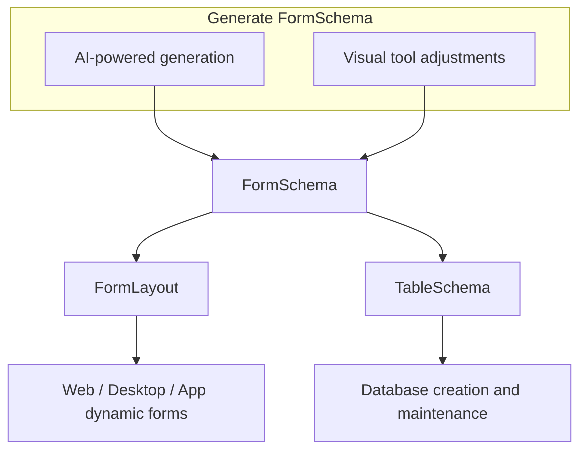
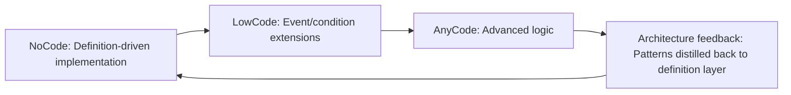

# Polhem Framework Architecture Overview

[繁體中文](../../zh-TW/architecture/architecture-overview.md) · [← Docs Index](../README.md)

> Definition-Driven Architecture: design philosophy and practical patterns for enterprise information systems

---

## Table of Contents

1. [Core Architecture Philosophy](#1-core-architecture-philosophy)
2. [Architecture Pattern Positioning](#2-architecture-pattern-positioning)
3. [FormSchema: The Definition Hub](#3-formschema-the-definition-hub)
4. [FormLayout: UI Layer Definition](#4-formlayout-ui-layer-definition)
5. [TableSchema: Data Layer Definition](#5-tableschema-data-layer-definition)
6. [DataSet as DTO](#6-dataset-as-dto)
7. [Business Object (BO)](#7-business-object-bo)
8. [Repository Dual-Track Strategy](#8-repository-dual-track-strategy)
9. [MVVM Integration](#9-mvvm-integration)
10. [NoCode / LowCode / AnyCode Evolution Axis](#10-nocode--lowcode--anycode-evolution-axis)
11. [Overall Architecture Diagram](#11-overall-architecture-diagram)
12. [Key Design Decision Summary](#12-key-design-decision-summary)

---

## 1. Core Architecture Philosophy

Polhem adopts a **Definition-Driven Architecture**, using `FormSchema` as the system's single source of truth to uniformly drive UI, database schema, and business logic. This addresses the core pain points of traditional enterprise information system development: specifications scattered across three layers, redundant implementations, and difficulty in maintenance.

**Design Principles:**

- **Encapsulate complexity in the architecture layer** to simplify application-level development
- **Use structural definitions to drive cross-layer automation** (UI / DB / Logic)
- **Make definitions the primary development interface**, not code

### Pain Points of Traditional Enterprise Information System Development

| Pain Point | Description |
|------------|-------------|
| Specifications scattered across layers | Adding a single field requires separate changes in UI / DTO / DB Migration, easily leading to inconsistencies |
| Scattered business logic | Different modules maintained by different engineers result in inconsistent styles and duplicated efforts |
| Customizations hard to standardize | Custom logic cannot be standardized, accumulating into unmanageable technical debt |

Polhem is designed with ERP as its complexity benchmark: form count, master-detail structure, numeric precision, and multi-company support are all sized to ERP requirements.

### Applicability Boundaries

| Suitable | Not Suitable |
|----------|--------------|
| Form-centric data applications (master/detail, auditing, validation) | High-concurrency, event-intensive systems (e-commerce, social media, gaming) |
| Multi-endpoint unified backend (Web / App / WinForms) | High-frequency microservice scenarios |
| Enterprise information systems (ERP, CRM, HRM — e.g. finance, procurement, warehouse, HR) | |

---

## 2. Architecture Pattern Positioning

Polhem adopts a **N-Tier + Clean Architecture + MVVM** hybrid pattern, borrowing the most suitable concepts from each pattern for enterprise information systems.

### Pattern Adoption Comparison

| Pattern | Adopted Concepts | Manifested in Polhem |
|---------|-----------------|----------------------|
| **N-Tier** | Clear layer boundaries, DataSet for cross-layer transfer, pragmatism | Distinct UI / API / BO / Repository / DB layers |
| **Clean Architecture** | Inward dependency direction, Domain Core as the most stable layer, Use Case isolation | FormSchema as Domain Core; BO as Use Case; Repository as Interface Adapter |
| **MVVM** | ViewModel isolates View from Model, two-way binding | FormSchema drives ViewModel structure; DataSet serves as Model |

### Pragmatic Trade-offs vs. Pure Clean Architecture

Pure Clean Architecture requires a strongly-typed Domain Entity for every business concept. ERP systems have a vast number of forms (hundreds or more), making the cost of writing Entity + Mapper for each one prohibitively high.

Polhem **replaces strongly-typed Entities with DataSet**, which brings:
- No need to define a corresponding Entity for every form
- FormSchema dynamically describes structure; adding a field requires no code changes
- Cross-layer transfer without mapping, eliminating unnecessary conversion layers

This is **pragmatic clean architecture** -- preserving dependency direction and separation of responsibilities while eliminating the unnecessary Entity modeling cost in form-centric applications.

---

## 3. FormSchema: The Definition Hub

`FormSchema` is the core of the Polhem architecture -- a **cross-layer shared structural description model**.

### Scope of Responsibility

- **Field definitions**: field name, data type, length, default value
- **Behavior definitions**: required, read-only, hidden, validation rules
- **Relationship definitions**: master/detail relationships between forms (FormSchemas)
- **SQL generation basis**: Repository CRUD dynamically generates SQL from FormSchema
- **UI derivation source**: FormLayout derives its layout structure from FormSchema **at design time**; the runtime renders the saved FormLayout definition and never derives one on the fly
- **DB derivation source**: TableSchema derives table structure from FormSchema
- **DbCategory routing**: `FormSchema.CategoryId` (required) determines which `DbCategory` the derived TableSchemas belong to (and thus the target connection / file path `TableSchema/{categoryId}/`)

### Definition Generation Flow



### Adjusting Derived Definitions

FormLayout and TableSchema are derived from FormSchema at design time and saved as definition files, which can then be adjusted by hand. Regeneration does not merge: `FormLayoutGenerator` and `TableSchemaGenerator` build a fresh definition from the FormSchema alone, and saving the result replaces the existing file (the DefineEditor asks before it overwrites a FormLayout). When a FormSchema changes after its derived files were adjusted, edit those files directly, or regenerate them and reapply the adjustments.

### Tenant Customization Overlay

For deployments serving multiple tenants, Polhem adds a **per-tenant customization overlay** on top of the base definitions. A `CustomizeId` (resolved from `SessionInfo.CustomizeId`, loaded from the company record at `EnterCompany`) drives an override layer for **Language / FormLayout / ProgramSettings / MenuSettings / PluginSettings only** — `FormSchema` / `TableSchema` stay tenant-agnostic so the database schema does not diverge per tenant.

The overlay is **two independent layers**: the base definition cache is never mutated, and the consumer decides per lookup (per key, progId or whole file) which layer wins. Plugin bindings are the one artifact where both layers apply: the base chain runs first, then the tenant's. The override layer is read-only at runtime except for `PluginSettings`, which a local-only maintenance API writes. An empty `CustomizeId` resolves against the base layer alone, as in a single-tenant deployment. See [Tenant Customization](../definitions/customization.md) and [ADR-016](../../../maintainers/adr/adr-016-multitenant-customization-overlay.md).

---

## 4. FormLayout: UI Layer Definition

`FormLayout` is the UI-dimension projection of FormSchema, describing the visual configuration of a form. It is produced at design time and stored as a definition file: a form renders the stored layout, and a missing one is a configuration error rather than a cue to generate a layout at runtime.

### Positioning

| | XAML | FormLayout |
|--|--|--|
| Purpose | General-purpose UI description language | Designed specifically for standardized business forms |
| Complexity | High; must handle all UI scenarios | Low; only describes Master / Detail / Field structure |
| Cross-platform | Primarily WPF / MAUI / Avalonia | Unified across Web / Desktop / App |
| Generation | Hand-written | Auto-derived from FormSchema, then fine-tuned |

### Standardized Form Layout Pattern

```
+------------------------------------+
| Header (master fields)             |  <- Fixed area
+------------------------------------+
| Tab 1: Detail Grid                 |  <- Detail area (One2Many)
| Tab 2: Additional Information      |
+------------------------------------+
| Footer (summary fields)            |  <- Fixed area
+------------------------------------+
```

This constrained layout pattern allows FormLayout to fully describe forms with a far more concise syntax than XAML, and dynamically render across Web / Desktop / App.

---

## 5. TableSchema: Data Layer Definition

`TableSchema` is the database-dimension projection of FormSchema, responsible for describing and maintaining table structures.

### Responsibilities

- Derive table columns, types, and lengths from FormSchema
- Execute database DDL: CREATE TABLE / ALTER TABLE (add and modify columns)
- DBA can independently adjust indexes, precision, and default values

### Adjustment Example

```
FormSchema: field Amount, type Decimal
    | derived
TableSchema default: DECIMAL(18, 2)
    | DBA adjustment (independent of FormSchema)
TableSchema actual: DECIMAL(24, 6)  +  INDEX  +  DEFAULT 0
```

FormSchema does not need to know database-layer optimization details; TableSchema can evolve independently (regenerating it from the FormSchema replaces such adjustments, see [Adjusting Derived Definitions](#adjusting-derived-definitions)).

---

## 6. DataSet as DTO

Polhem uses ADO.NET `DataSet` as the cross-layer Data Transfer Object (DTO), rather than custom strongly-typed POCOs.

### Rationale

| Characteristic | Description |
|----------------|-------------|
| **Natural Master-Detail shape** | A form's master and detail tables travel as sibling `DataTable`s in one DataSet, which is the shape nearly all business forms take. The framework does not build `DataRelation`s to link them: a detail row carries `sys_master_rowid` pointing at the master row's `sys_rowid`, and the FormSchema declares which table is the master (see `src/Polhem.Repository/Form/DataFormRepository.cs` and `src/Polhem.Definition/Forms/FormRowDefaults.cs`) |
| **Self-describing structure** | DataSet carries its own schema; no additional type definitions needed during transfer |
| **Multi-table transport** | A single DataSet can carry a master table plus multiple detail tables, transferring an entire transaction's data at once |
| **Cross-layer consistency** | UI layer, BO layer, and Repository layer share the same object; no mapping required |

### Design Boundary

DataSet is purely a **data container** and contains no business logic whatsoever. All logic resides in the BO; DataSet only provides data.

---

## 7. Business Object (BO)

`Business Object` (BO) is the core of business logic, corresponding to the Use Case layer in Clean Architecture.

### Responsibilities

- Provide methods corresponding to form operations (Save, Delete, Validate, Query...)
- Execute data validation based on FormSchema
- Coordinate DataSet (data) and Repository (data access)
- **Never access the database directly**; always go through Repository

### Typical Method Structure

```csharp
public class SalesOrderBO : BusinessObject
{
    public SalesOrderBO(IBusinessObjectContext ctx, Guid accessToken, string progId, bool isLocalCall = false)
        : base(ctx, accessToken, progId, isLocalCall) { }

    // CRUD: via FormSchema-driven Repository (auto-routed to the right DB)
    [ApiAccessControl(ApiProtectionLevel.Encrypted, ApiAccessRequirement.Authenticated)]
    public DataSet? Save(DataSet ds)
    {
        // 1. Validate DataSet data based on FormSchema
        // 2. Use the BO base helper — DB routing is automatic
        var repository = CreateDataFormRepository(ProgId);
        // 3. Repository executes INSERT / UPDATE on the resolved database
        var (refreshed, _) = repository.Save(ds);
        return refreshed;
    }

    // Reports: BO selects DB scope explicitly, implements SQL directly
    // (ReportFilter and SalesReportRepo are your own types)
    [ApiAccessControl(ApiProtectionLevel.Encrypted, ApiAccessRequirement.Authenticated)]
    public DataSet GetSalesSummaryReport(ReportFilter filter)
    {
        var dbId = ResolveDatabaseId(DbScope.Company);   // type-safe, no magic string
        var repo = new SalesReportRepo(
            Services.GetRequiredService<IDbAccessFactory>(), dbId);
        return repo.GetSummary(filter);   // custom SQL inside the repository
    }
}
```

A public instance method of a business object that takes one parameter is reachable as a JSON-RPC action, so each one declares its protection level with `[ApiAccessControl]`; the POLHEM3001 analyzer warns about one that does not.

A single BO can mix both Repository strategies; the caller does not need to know which track is used underneath.

### Session Lifecycle and Database Scope

BO method execution is bracketed by a two-phase session lifecycle (see [ADR-012](../../../maintainers/adr/adr-012-session-company-context.md)):

```
Login(account, password)   ──→  Logged-in (SessionInfo.CompanyId = null)
EnterCompany(companyId)    ──→  In-company (SessionInfo.CompanyId = ...)
LeaveCompany()             ──→  back to Logged-in
Logout()                   ──→  Session destroyed (implicitly clears CompanyId)
```

Three logical database scopes (`DbScope.Common` / `DbScope.Log` / `DbScope.Company`) map to physical databases via `IRepositoryDatabaseRouter`. `Common` and `Log` route to fixed databaseIds and can be used pre-EnterCompany; `Company` requires the session to have entered a company.

---

## 8. Repository Dual-Track Strategy

Repository adopts a **dual-track parallel** design, choosing the appropriate implementation based on the nature of the operation.

### Dual-Track Comparison

| Track | Applicable Operations | SQL Source | Characteristics |
|-------|----------------------|------------|-----------------|
| **FormSchema-driven** ([details](../definitions/formschema-data-access.md)) | CRUD (create, update, delete) | Dynamically generated from FormSchema | Define once, auto-sync; no hand-written SQL |
| **AnyCode** | Reports, analytical queries, batch operations | Written by BO | Full control; complex JOINs, aggregations, performance tuning |

### Why This Division

Business-form CRUD operations are highly homogeneous; nearly all forms follow:

```
Validate required -> Validate format -> Validate relationships -> INSERT / UPDATE / DELETE
```

This 80% of workload is handled by FormSchema-driven operations -- developers only need to define, not write code.

Reports and batch operations often involve multi-table JOINs + GROUP BY + dynamic conditions, or require control over transaction boundaries and batching strategies. Forcing them into FormSchema would only add unnecessary complexity.

### Shared Infrastructure and Transaction Boundaries

Both tracks run on the same data access infrastructure: `Polhem.Db` (`DbAccess`, the provider registries and the dialects) and the database routing of `IRepositoryDatabaseRouter`.

They do **not** share a transaction. The transaction boundary is one repository call: `IDataFormRepository.Save` writes the master and detail tables of one DataSet in a single transaction, and `Delete` removes a master row and its details in another. An AnyCode repository controls its own transactions through `DbAccess` (for example a `DbBatchSpec` with `UseTransaction`, or `Execute` with a `DbTransaction` of its own). The framework does not enlist a FormSchema-driven call and an AnyCode call in one transaction, so a write that must be atomic across both (e.g. saving an order and adjusting inventory) has to be done inside one AnyCode transaction.

---

## 9. MVVM Integration

Polhem integrates with the frontend using the MVVM pattern, with FormSchema directly driving the ViewModel binding structure.

### Layer Mapping

| MVVM Role | Polhem Counterpart | Description |
|-----------|--------------------|-------------|
| **Model** | DataSet | Carries form data; no logic |
| **ViewModel** | Derived from FormSchema | Field behavior, validation rules, binding structure |
| **View** | Web / Desktop / App | Dynamically rendered via FormLayout |

### Data Flow

```
User interaction
    |^ (two-way binding)
ViewModel (binding structure derived from FormSchema)
    |^
DataSet (Model)
    |
BO.Save(DataSet)
    |
Repository -> Database
```

When FormSchema changes, the ViewModel binding structure updates automatically; the View requires no manual adjustments.

---

## 10. NoCode / LowCode / AnyCode Evolution Axis

Polhem provides three levels of development depth along a single evolution axis -- they are complementary, not mutually exclusive technology stacks.

### Three-Level Comparison

| Mode | Flexibility | Implementation | Applicable Scenarios |
|------|-------------|----------------|---------------------|
| **NoCode** | Medium | FormSchema -> FormLayout + TableSchema generated at design time | Standard workflows, data-oriented forms |
| **LowCode** | High | Events, conditions, and rules to extend BO | Light customization logic |
| **AnyCode** | Full | Custom UI / BO methods / AnyCode Repository | Complex logic, cross-module integration, reports and batch operations |

### Evolution Cycle



Common patterns discovered during each AnyCode customization can be distilled back into FormSchema or BO base classes, making the next development cycle more automated.

---

## 11. Overall Architecture Diagram

```
+------------------------------------------------------+
|  View                                                |
|  Avalonia (desktop / browser / mobile) / Blazor Server / your own host |  MVVM: View
+------------------------------------------------------+
|  ViewModel                                           |  MVVM: ViewModel
|  (binding structure derived from FormSchema)         |
+------------------------------------------------------+
|  API Layer  (Polhem.JsonRpc / JSON-RPC 2.0)           |  N-Tier: Presentation
+------------------------------------------------------+
|                                                      |
|  Business Object (BO)                                |  Clean Arch: Use Case
|  +- CRUD methods (FormSchema validation + Repository)|
|  +- Report methods (AnyCode Repository)              |
|  +- Batch methods (AnyCode Repository)               |
|                                                      |
|  +----------------------------------+                |
|  |  FormSchema (definition hub)     |                |  Clean Arch: Domain Core
|  |  Field behavior / Form relations |                |
|  |  / Validation rules              |                |
|  +------+-----------------+---------+                |
|         |                 |                          |
|   FormLayout         TableSchema                     |
|   (UI layout)        (table structure)               |
|                                                      |
+------------------------------------------------------+
|  DataSet (DTO)                                       |  N-Tier: Data Transfer
|  Master Table + Detail Tables                        |
+------------------------------------------------------+
|  Repository                                          |  Clean Arch: Interface Adapter
|  +- FormSchema-driven (CRUD SQL auto-generated)      |
|  +- AnyCode (reports/batch, BO-implemented)          |
+------------------------------------------------------+
|  Polhem.Db (data access infrastructure)                 |  N-Tier: Data Layer
|  +- IDialectFactory routes per DatabaseType          |
|  +- DbDialectRegistry: SQLServer / PostgreSQL / SQLite / ...  |
|  +- DbProviderRegistry: ADO.NET DbProviderFactory     |
+------------------------------------------------------+
|  Database (MSSQL / PostgreSQL / SQLite / MySQL ...) |
+------------------------------------------------------+
```

> Which heads `Polhem.UI.Avalonia` runs on, and what each one needs, is in
> [Platform Support](../getting-started/platform-support.md).
>
> Provider registration is explicit: the host app calls
> `DbProviderRegistry.Register(...)` and
> `DbDialectRegistry.Register(...)` for each database it actually uses.
> `Polhem.Db` itself has zero ADO.NET driver dependencies. See
> [`src/Polhem.Db/README.md`](../../../src/Polhem.Db/README.md) for the registration
> code example.

---

## 12. Key Design Decision Summary

| Decision Point | Choice | Rationale |
|----------------|--------|-----------|
| **DTO type** | ADO.NET DataSet | Form Master-Detail structure; cross-layer consistency without mapping |
| **Domain core** | FormSchema (not Entity) | Vast number of ERP forms; dynamic definitions are superior to modeling each one individually |
| **Logic layer** | BO (independent of data) | Clean Arch Use Case; does not depend on DB implementation details |
| **CRUD SQL** | Dynamically generated from FormSchema | Define once; adding fields auto-syncs |
| **Complex queries/batch** | AnyCode Repository | Reports/batch require full control; the framework should not constrain complex scenarios |
| **UI definition** | FormLayout (not XAML) | Designed for standardized form layouts; constrained structure, more concise syntax |
| **DB maintenance** | TableSchema derivation + adjustable | Auto-sync with definitions; DBA can still independently optimize indexes and types |
| **Architecture hybrid** | N-Tier + Clean Arch + MVVM | Borrowing the most suitable concepts for enterprise information systems from each; not forcing pure theoretical application |
| **Audit trail** | Opt-in `st_log_*` tables via `IAuditLogWriter` / `IAnomalyLogWriter` (`AuditLogOptions`) | Data trail on the login, change (DiffGram before-after), access, API anomaly and DB anomaly axes; background, best-effort, self-sufficient (denormalised) log rows |
