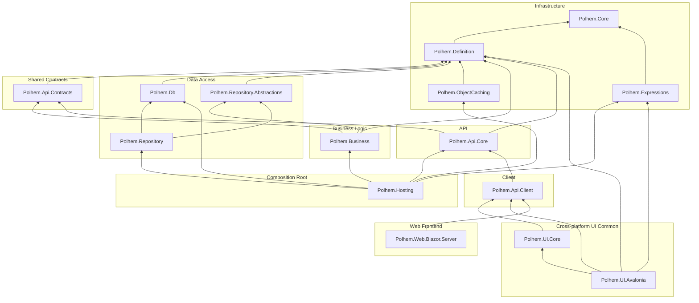

# Project Dependency Map

[繁體中文](../../zh-TW/architecture/dependency-map.md) · [← Docs Index](../README.md)

This document visualizes the dependencies among the `src/` projects of the Polhem framework.
The diagram covers the runtime packages; `Polhem.Analyzers` is left out because nothing references it
at runtime — consumers get it as a build-time analyzer, and drawing it would add an edge that does
not exist in the assembly graph. (No project count here: it drifts, and the `src/` directory is the
authority.)

**How to read**: an arrow A → B means "A depends on B"; the diagram is laid out bottom-up, with the most foundational packages (no dependencies) at the bottom.

## Dependency Diagram

## External Package Dependencies

| Project | External Packages |
|---------|-------------------|
| Polhem.Core | *(none)* |
| Polhem.Expressions | DynamicExpresso.Core 2.x |
| Polhem.Definition | Microsoft.Extensions.Localization.Abstractions 10.x |
| Polhem.Db | *(none)* |
| Polhem.ObjectCaching | Microsoft.Extensions.Caching.Memory 10.x, Microsoft.Extensions.Logging.Abstractions 10.x |
| Polhem.Api.Core | MessagePack 3.x, Microsoft.Extensions.Logging.Abstractions 10.x, Polhem.JsonRpc.Server, Polhem.JsonRpc.Payload.Server |
| Polhem.Business | Microsoft.Extensions.DependencyInjection.Abstractions 10.x, Microsoft.Extensions.Logging.Abstractions 10.x |
| Polhem.Repository | Microsoft.Extensions.DependencyInjection.Abstractions 10.x |
| Polhem.Hosting | Microsoft.Extensions.DependencyInjection.Abstractions 10.x, Microsoft.Extensions.Hosting.Abstractions 10.x |
| Polhem.Web.Blazor.Server | `FrameworkReference: Microsoft.AspNetCore.App` |
| Polhem.UI.Avalonia | Avalonia 12.0.x, Avalonia.Controls.DataGrid 12.0.x |
| Polhem.Api.Client | Polhem.JsonRpc.Client |
| Polhem.Api.Contracts / Polhem.Repository.Abstractions / Polhem.UI.Core | *(none)* |

> `Polhem.Api.Core`'s MessagePack reference is the only transport-format package in the framework, and
> keeping it the only one is the point of [ADR-036](../../../maintainers/adr/adr-036-wire-serialization-externalized.md).
> The `Polhem.JsonRpc.*` packages are maintained in
> [polhem-dev/polhem-jsonrpc](https://github.com/polhem-dev/polhem-jsonrpc); the version the framework uses is set in
> `PolhemJsonRpc.props` at the repository root. An HTTP host adds `Polhem.JsonRpc.AspNetCore` itself.
> Build-time-only references (`PrivateAssets="all"`: SourceLink, the public API analyzers, the
> repository's own analyzers) are omitted — they reach no consumer.

## Target Framework Summary

All runtime packages target `net10.0`. The exception is `Polhem.Analyzers`, which targets
`netstandard2.0` — that is what Roslyn loads analyzers as, so it is a requirement of the analyzer
host rather than a choice.

## Tooling Packages (separately distributed)

Not part of the `src/` library graph above — these ship as `dotnet tool` global tools on NuGet:

| Package | Command | Description |
|---------|---------|-------------|
| **Polhem.Cli** (`tools/Polhem.Cli/`) | `dotnet polhem` | Framework CLI; `dotnet polhem --help` lists its commands. References `Polhem.Definition`, whose public `Defaults` API it calls for materialise / list operations on embedded framework defaults. Versioned with the framework (both read `Version.props`). |

Also under `tools/` but not on NuGet:

- **Polhem.DefineEditor** (`tools/DefineEditor/`) — Avalonia desktop tool for visually editing the define types. Distributed as a downloadable `.app` / `.exe` rather than as a library or dotnet tool. Calls `Polhem.Definition.Defaults.MaterializeTo(...)` in-process on folder open.

## Architectural Notes

- **Polhem.Core** is the lowest-level foundation package with no internal dependencies.
- **Polhem.Expressions** holds `DynamicExpressoEvaluator`, the DynamicExpresso-backed implementation of the expression engine. The *abstraction* — `IExpressionEvaluator`, `ExpressionPolicy`, `ExpressionEvaluationException` — lives in `Polhem.Core.Expressions`, so `Polhem.Definition` (the `FormExpressionCalculator`) and `Polhem.Business` (the rule processor) consume the engine without taking a dependency on DynamicExpresso; only the composition roots that pick an implementation (`Polhem.Hosting` for DI registration, `Polhem.UI.Avalonia` for client-side live preview) reference this package. That split keeps the definition layer free of third-party packages while a field computed on the client still matches what the server writes on save. See [adr-028](../../../maintainers/adr/adr-028-expression-rule-engine.md) and [adr-038](../../../maintainers/adr/adr-038-definition-dependency-boundary.md).
- **Polhem.Definition** is the most depended-on project. Its direct dependents are Contracts, Db, RepoAbs, Caching, Business, Api.Core and UI.Avalonia.
- **Polhem.Api.Contracts** is a shared contract/abstraction layer, not an application-level API project. Despite the "API" name, both `Polhem.Business` and `Polhem.Api.Core` depend on it (`Business → Contracts`, `Core → Contracts`), so it sits *below* them — the diagram groups it under **Shared Contracts** rather than the API application layer.
- **Polhem.Hosting** is the composition root: it consolidates the backend services (`Polhem.Api.Core`, `Polhem.Business`, `Polhem.Db`, `Polhem.Repository`, `Polhem.ObjectCaching`) behind a single `AddPolhemFramework` extension on `IServiceCollection`, with no ASP.NET Core dependency. Non-web hosts (WinForms, Console, Worker Service) reference it directly. It is shown in its own **Composition Root** group rather than under API: reaching across every layer is what a composition root does, so the "API layer must not reference the Repository layer" constraint does not apply to it. What *does* apply is that it holds no data access of its own — statements live in `Polhem.Db` / `Polhem.Repository`, and Hosting keeps only the hosted-service shells and DI wiring.
- **The JSON-RPC protocol** comes from the `Polhem.JsonRpc.*` packages, which know nothing about Polhem: `Polhem.Api.Core` builds on `Polhem.JsonRpc.Server`, `Polhem.Api.Client` on `Polhem.JsonRpc.Client`, and an ASP.NET Core host adds `Polhem.JsonRpc.AspNetCore` for the `POST /api` endpoint. The dependency only goes that way. See [ADR-049](../../../maintainers/adr/adr-049-jsonrpc-packages-in-1-2.md).
- Both the client (Polhem.Api.Client) and the server share the payload envelope via **Polhem.Api.Core**, ensuring consistent serialization and encryption behavior.
- **Polhem.UI.Core** is the cross-platform UI common layer (`ClientInfo` / `IEndpointStorage` / `FileEndpointStorage` / `IUIViewService`), shared by every native-UI family (currently Avalonia, which covers desktop / browser (WASM) / iOS / Android from one project; future WinForms / WPF) for client-side connection state and endpoint persistence. It contains no platform-specific UI code and depends only on `Polhem.Api.Client`.
- **Polhem.UI.Avalonia** is the Avalonia control library for the desktop, browser (WASM), iOS and Android heads; what each head needs is in [Platform Support](../getting-started/platform-support.md). Ships FormSchema-driven controls (`FormView` for a single record, `ListView` for the list, `GridControl` for grids, plus a field-editor family with `FormScope` ambient binding, all backed by `FormDataObject`) over a single `net10.0` TFM. Its `Avalonia` and `Avalonia.Controls.DataGrid` references are lower bounds; a host may bring a newer `Avalonia 12.0.x`. See [adr-020](../../../maintainers/adr/adr-020-avalonia-datagrid-binding-strategy.md) for the DataGrid binding strategy and [adr-021](../../../maintainers/adr/adr-021-avalonia-datagrid-editing-strategy.md) for the editing strategy.
- **`Polhem.UI.*` family criterion**: whether the package consumes the `Polhem.UI.Core` abstractions (`ClientInfo` / `IEndpointStorage` / `IUIViewService`, etc.).
  - Consumes → `Polhem.UI.*` (current: `Polhem.UI.Core`, `Polhem.UI.Avalonia`; future: `Polhem.UI.WinForms`, `Polhem.UI.Wpf`, etc.)
  - Does not consume, has its own state management → independent family prefix (e.g. `Polhem.Web.Blazor.*`: a Blazor circuit has no file IO and no dialog service concept, so an independent path is appropriate).
- The **Web frontend layer** (`Polhem.Web.Blazor.Server`) is a Razor Class Library (RCL). It depends only on `Polhem.Api.Client`; the host application chooses the transport in `AddPolhemBlazor`: `UseRemoteProvider` (`RemoteApiProvider` over HTTP) or `UseLocalProvider` (`LocalApiProvider` in process, for trusted users only, which also needs `AddPolhemFramework` on the same service collection).
