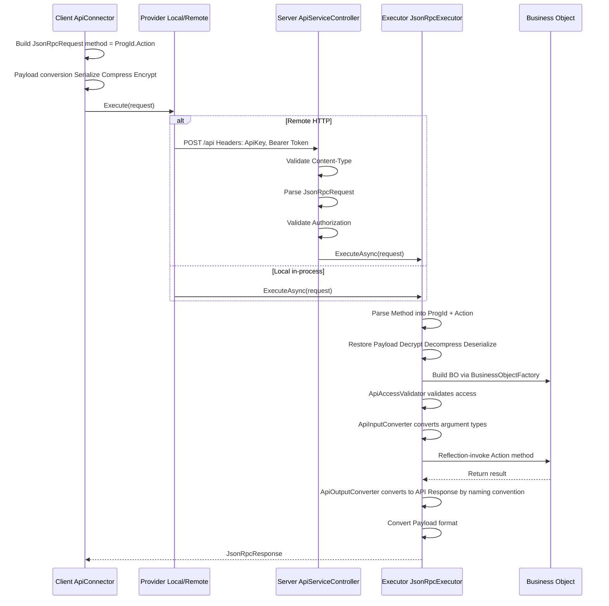

<!-- source: zh-TW/development-cookbook.md blob: 065e96b01ea5534348224f1d38485c0620f758e8 -->
# End-to-End Development Cookbook

[繁體中文](../zh-TW/development-cookbook.md) · [← Docs Index](README.md)

> This document explains the core development flow of the Polhem framework, helping developers (and AI coding tools) understand the full chain from definition to API.

## Framework Initialization Order

The framework registers itself in the standard `IServiceCollection` DI container;
framework services are resolved through ctor injection — there is no static
entry point (service locator).

### Host Startup Flow

```text
┌─────────────────────────────────────────────────────┐
│ 1. paths = new PathOptions { DefinePath = "..." }   │
│ 2. settings = SystemSettingsLoader.Load(paths)      │
│ 3. SysInfo.Initialize(settings.CommonConfiguration) │
├─────────────────────────────────────────────────────┤
│ 4. services.AddPolhemFramework(                        │
│      settings.BackendConfiguration,                 │
│      paths,                                         │
│      autoCreateMasterKey: true)                     │
│    → from Polhem.Hosting (composition root)            │
│    → Registers IDefineStorage / IDefineAccess /     │
│      ICacheContainer / IDbConnectionManager /       │
│      ISessionInfoService / ILanguageService /       │
│      IBusinessObjectFactory / JsonRpcExecutor       │
├─────────────────────────────────────────────────────┤
│ 5. provider = services.BuildServiceProvider()       │
│ 6. app.UsePolhemFramework() (ASP.NET only — startup   │
│    checks; registers no middleware or endpoint)    │
└─────────────────────────────────────────────────────┘
```

Host package selection:

- **ASP.NET Core web host**: reference `Polhem.Api.AspNetCore` (it transitively pulls in `Polhem.Hosting`). Add `using Polhem.Hosting;` for `AddPolhemFramework` and `using Polhem.Api.AspNetCore;` for `UsePolhemFramework`.
- **Non-ASP.NET Core host** (WinForms / WPF / Console / Worker Service / integration tests): reference `Polhem.Hosting` directly. No `Microsoft.AspNetCore.App` dependency. After `BuildServiceProvider()`, set `ApiClientInfo.LocalServiceProvider = sp` to enable `Polhem.Api.Client`'s near-end (in-process) mode.

Reference implementation: `tests/Polhem.Tests.Shared/TestProcessBootstrap.cs` — applies
the same flow for the test process with `tests/Define/` (merged with the embedded
framework defaults at process start) as the `DefinePath`.

### First-time `DefinePath` setup

Step 1 of the startup flow requires `DefinePath` to exist with the framework's
minimum define files (`st_*` TableSchemas, `SystemSettings.xml`, `DatabaseSettings.xml`,
`DbCategorySettings.xml`, framework-shipped Department / Employee forms). The
framework ships these as embedded resources in `Polhem.Definition.dll`; consumers
materialise them once into the target directory before first run.

```bash
# install the framework CLI (one-time, machine-wide)
dotnet tool install -g Polhem.Cli

# materialise framework defaults into your DefinePath
dotnet polhem defines materialize --path ./Define

# tweak SystemSettings (set MasterKeySource) + DatabaseSettings (add connection strings)
# then start the app — DefinePath is now wired up
```

The CLI is a thin shell over `Polhem.Definition.Defaults.MaterializeTo(...)`; the
same API is available programmatically for hosts that prefer to materialise from
code, and `tools/DefineEditor` calls it automatically when you open a folder.
Skip-existing is the default so re-running never overwrites your customisations.

See [Framework-Reserved Names](framework-reserved-names.md) for the complete
list of files and consumer extension guidelines.

## Request Processing Pipeline

### Full Request Flow



### Payload Formats

| Format | Pipeline | Use Cases |
|--------|----------|-----------|
| Plain | No transformation | Local calls, dev debugging |
| Encoded | Serialize → Compress | General API calls |
| Encrypted | Serialize → Compress → Encrypt | Sensitive data transmission |

Downgrade rule: requesting Encrypted without an encryption key automatically downgrades to Encoded.

## API Contract Three-Tier Separation

The framework separates API types into three tiers, preventing serialization attributes from polluting business logic:

### Tier Mapping

| Tier | Assembly | Base Class | Characteristics |
|------|----------|------------|-----------------|
| Contract | Polhem.Api.Contracts | None (pure interface) | `ILoginRequest`, `ILoginResponse`, etc. |
| API Type | Polhem.Api.Core | `ApiRequest` / `ApiResponse` | Implements Contract interface + MessagePack `[Key]` attributes |
| BO Type | Polhem.Business | `BusinessArgs` / `BusinessResult` | Implements Contract interface, pure POCO |

### Type Conversion Flow

```text
Client sends → LoginRequest (API Type, MessagePack)
    ↓ JsonRpcExecutor
    ↓ ApiInputConverter property mapping ({Action}Request → {Action}Args)
BO receives → LoginArgs (BO Type, POCO)
    ↓ business logic
BO returns → LoginResult (BO Type, POCO)
    ↓ ApiOutputConverter naming convention ({Action}Result → {Action}Response)
Client receives → LoginResponse (API Type, MessagePack)
```

### Key Components

- **ApiInputConverter**: maps API Request property values to BO Args (matched by property name) and handles `JsonElement` from HTTP input
- **ApiOutputConverter**: after execution, automatically maps BO `{Action}Result` to `{Action}Response` via reflection; results cached in `ConcurrentDictionary` (see [ADR-007](../adr/adr-007-convention-based-type-resolution.md))
- The wire body is written by the codec the request declares (`messagepack` or `json`); it plays no part in output mapping. See [ADR-044](../adr/adr-044-payload-codec-negotiation.md).

## ExecFunc Custom Function Pattern

ExecFunc is the framework's extension mechanism, allowing developers to add custom business logic without modifying the framework core.

### Development Steps

#### 1. Define a Handler Class

Inherit or implement `IExecFuncHandler`, and add methods to the corresponding handler class:

- Form-level: `FormExecFuncHandler`
- System-level: `SystemExecFuncHandler`

#### 2. Implement Methods

```csharp
// Form-level example
public class FormExecFuncHandler
{
    /// <summary>
    /// A simple greeting function.
    /// </summary>
    public void Hello(ExecFuncArgs args, ExecFuncResult result)
    {
        result.Parameters.Add("Hello", "Hello form-level BusinessObject");
    }
}

// System-level example (authentication required)
public class SystemExecFuncHandler
{
    private readonly IRepositoryFactory _repositoryFactory;

    public SystemExecFuncHandler(IRepositoryFactory repositoryFactory)
    {
        _repositoryFactory = repositoryFactory;
    }

    /// <summary>
    /// Upgrades the table schema for the specified database.
    /// </summary>
    [ExecFuncAccessControl(ApiAccessRequirement.Authenticated)]
    public void UpgradeTableSchema(ExecFuncArgs args, ExecFuncResult result)
    {
        string databaseId = args.Parameters.GetValue<string>("DatabaseId");
        string dbName = args.Parameters.GetValue<string>("DbName");
        string tableName = args.Parameters.GetValue<string>("TableName");

        var repo = _repositoryFactory.Create<IDatabaseRepository>();
        bool upgraded = repo.UpgradeTableSchema(databaseId, dbName, tableName);
        result.Parameters.Add("Upgraded", upgraded);
    }
}
```

#### 3. Client-Side Invocation

```csharp
// Form-level
var connector = new FormApiConnector(accessToken, "Employee");
var response = await connector.ExecFuncAsync(new ExecFuncRequest { FuncId = "Hello" });

// System-level
var sysConnector = new SystemApiConnector(accessToken);
var response = await sysConnector.ExecFuncAsync(new ExecFuncRequest
{
    FuncId = "UpgradeTableSchema",
    Parameters = new ParameterCollection
    {
        { "DatabaseId", "main" },
        { "DbName", "MyDb" },
        { "TableName", "Employee" }
    }
});
```

### Execution Flow

```text
Client: await connector.ExecFuncAsync(new ExecFuncRequest { FuncId = "Hello" })
  → ApiConnector.ExecuteAsync<ExecFuncResponse>("ExecFunc", args)
  → JsonRpcRequest { method: "Employee.ExecFunc" }
  → JsonRpcExecutor calls FormBusinessObject.ExecFunc()
  → BusinessObject.DoExecFunc()
  → handler.InvokeExecFunc()  // ExecFuncHandlerExtensions extension method
    → handler.GetType().GetMethod("Hello")  // reflection lookup
    → check [ExecFuncAccessControl] attribute
    → method.Invoke(handler, args, result)  // reflection invocation
  → return ExecFuncResult
```

## FormSchema-Driven Development

FormSchema is the framework's definition hub, simultaneously driving UI, database, and validation rules.

### Core Concept

```text
FormSchema (Single Source of Truth)
├── ProgId: "Employee"
├── DisplayName: "Employee Management"
├── CategoryId: "common"        ← required, determines which DbCategory the derived TableSchema belongs to
├── Tables: FormTableCollection
│   ├── Master: FormTable
│   │   ├── TableName: "Employee"
│   │   ├── DbTableName: "dbo.Employee"
│   │   └── Fields: FormFieldCollection
│   └── Detail: FormTable (detail table)
│       ├── TableName: "EmployeeHistory"
│       └── Fields: FormFieldCollection
│
├── → derives TableSchema (database dimension)
├── → derives FormLayout at design time (UI dimension)
└── → drives IFormCommandBuilder family (SQL generation)
```

### CategoryId and DbCategory Routing

Every FormSchema must specify `CategoryId`, which corresponds to the `Id` of a `<DbCategory Id="...">` in `DbCategorySettings.xml`. `CategoryId` simultaneously determines:

- TableSchemas derived from this FormSchema are persisted under the `TableSchema/{categoryId}/` subdirectory
- Which database connection the tables of this FormSchema belong to (derived via DbCategory → `DbScope` → `IRepositoryDatabaseRouter`)

`SaveFormSchema` validates that `CategoryId` is non-empty (via `TableSchemaGenerator.GetCategoryId(formSchema)`); throws `InvalidOperationException` when missing.

### Resolving DatabaseId in a BO Method

A BO method should never hard-code a `databaseId` string or read `SessionInfo.CompanyId` / `CompanyInfo` directly. Use the `BusinessObject` base helpers instead:

```csharp
// FormSchema-driven CRUD — one-liner, auto-routed
var repository = CreateDataFormRepository(ProgId);
// Equivalent to:
// Services.GetRequiredService<IRepositoryFactory>()
//         .CreateFormRepository<IDataFormRepository>(AccessToken, ProgId);

// Custom bo repo — resolve databaseId for the target scope, then build the repo
var dbId = ResolveDatabaseId(DbScope.Log);   // "log" (no session needed)
var dbId = ResolveDatabaseId(DbScope.Company); // routes via session.CompanyId → CompanyInfo.CompanyDatabaseId
var repo = new MonthlySalesReportRepo(Services.GetRequiredService<IDbAccessFactory>(), dbId);
```

`DbScope` resolution rules:

| `DbScope` | Resolved `databaseId` | Requires session? |
|-----------|----------------------|-------------------|
| `Common` | Fixed `"common"` | No |
| `Log` | Fixed `"log"` | No (Login / Logout etc. can write audit log pre-EnterCompany) |
| `Company` | `SessionInfo.CompanyId` → `CompanyInfo.CompanyDatabaseId` | Yes — throws `UnauthorizedAccessException` / `CompanyNotEntered` if not ready |

See [ADR-010 §「後續延伸：執行時路由」](../adr/adr-010-logical-database-category.md) for the routing design and [ADR-012](../adr/adr-012-session-company-context.md) for the session lifecycle that drives `DbScope.Company`.

### Customising the BO for a ProgId

The framework instantiates `FormBusinessObject` by default for every `ProgId`. When a form needs behaviour that goes beyond the FormSchema-driven CRUD pipeline (custom validation, domain events, AnyCode SQL, etc.), subclass `FormBusinessObject` and bind the subclass through `ProgramSettings.xml`.

#### 1. Subclass `FormBusinessObject`

```csharp
namespace MyErp.Business;

public class CustomerBo : FormBusinessObject
{
    public CustomerBo(IPolhemContext ctx, Guid accessToken, string progId, bool isLocalCall = true)
        : base(ctx, accessToken, progId, isLocalCall) { }

    // Override a Do* hook (see the next section) or add custom methods
    // exposed via [ApiAccessControl].
    protected override void DoBeforeSave(SaveContext context)
    {
        base.DoBeforeSave(context);
        // custom validation or computed values
    }
}
```

#### 2. Bind the subclass in `ProgramSettings.xml`

```xml
<ProgramItem ProgId="Customer"
             DisplayName="Customer Management"
             BusinessObject="MyErp.Business.CustomerBo, MyErp.Business" />
```

`BusinessObject` uses the assembly-qualified format (`"Namespace.Type, AssemblyName"`). When empty, the resolver falls back to `FormBusinessObject` — so you only need to declare `BusinessObject` for the ProgIds that actually need customisation.

#### 3. Resolution behaviour

`ProgramSettingsBoTypeResolver` (registered by `AddPolhemFramework`) looks up `ProgramItem.BusinessObject`, loads the type via `AssemblyLoader`, and verifies it derives from `BusinessObject`. **A declared name that will not resolve throws** — an unloadable type, or one with the wrong base class, is a configuration error with no harmless reading. Falling back would buy only the appearance of a running system: `FormBusinessObject` accepts any progId, so it constructs happily and the failure surfaces later as generic behaviour where custom logic was expected.

Incremental adoption is still safe, because **declaring nothing is not a failure**: a progId the registry does not mention, or one whose `BusinessObject` is empty, resolves to `FormBusinessObject` as before. Only declare `BusinessObject` for the progIds you actually customise.

The **reserved progIds** `System` and `AuditLog` follow the same policy with a tighter base-type constraint: they must resolve to the framework object for that axis, or a subclass of it. The host registers both progIds at startup when they are absent, so an existing `ProgramSettings.xml` needs no manual edit.

Resolved types are cached for the lifetime of the in-memory `ProgramSettings` instance; when `ProgramSettingsCache` reloads the file (via its file watcher), the cache resets automatically.

### BO Extension Points and the Transaction Boundary

`Save` and `Delete` are each split into three overridable steps. **Override one of those, not the
public method** — the authorization and record-scope checks live in the public method, and replacing
it takes them over too.

```text
Save:   DoBeforeSave  →  DoSave  →  [change audit]  →  DoAfterSave
Delete: DoBeforeDelete → DoDelete → [delete audit]  → DoAfterDelete
                          ↑
                only this step runs inside the database transaction
```

The transaction is opened and committed by the repository, within `DoSave` / `DoDelete`. Everything
else — including work you add around `base.DoSave(context)` in an override — runs outside it.

That boundary is deliberate: `DoBeforeSave` evaluates expressions, reads lookups and may call other
business objects, while `DoAfterSave` is where notifications and calls to other systems belong.
Holding a transaction open across those ties lock duration to external latency, which is how
connection pools drain and distributed deadlocks appear.

#### Aborting the operation

Throw `UserMessageException` — the framework's business-flow interruption signal. It travels to the
client as `JsonRpcErrorCode.UserMessage` and is rebuilt there as the same type, so the message
reaches the end user unchanged. The schema-driven rule engine uses the same mechanism for its
`BeforeSave` validation rules.

```csharp
protected override void DoBeforeSave(SaveContext context)
{
    base.DoBeforeSave(context);
    if (/* business condition fails */)
        throw new UserMessageException("The credit limit for this customer has been exceeded.");
}
```

#### Three consequences to design around

**Validation in `DoBeforeSave` has a time-of-check to time-of-use gap.** A read that finds stock
sufficient can be invalidated by another transaction before `DoSave` runs, and the save still
proceeds. Throwing an exception settles *how* to abort; it does not make the check current at write
time. Checks that must be atomic belong inside the transaction — a conditional UPDATE, a unique
index, or a check constraint in a repository subclass. Reads in `DoBeforeSave` are for rejecting
obviously wrong input, not for guarding against concurrency.

**The change audit is not atomic with the data.** It is written after `DoSave` returns, so a record
can persist while its audit entry fails. Raising the audit into the transaction would make `DoSave`
more than persistence and require a transaction API at the business-object layer; the framework
accepts the gap instead.

**A failure in `DoAfterSave` leaves the data saved.** The exception propagates and the call reports
failure, but the transaction committed before that step began. Side effects placed there must
tolerate being retried, or be handed to a queue rather than performed inline — a notification sent
synchronously and then failing leaves nothing to retry from.

#### When logic must be atomic with the record

Put it in the repository, not the business object. Subclass `DataFormRepository` and extend its
`Save` so the extra statements join the same batch — see the next section.

### Business Plugins

Subclassing replaces the business object; a **plugin** adds a step to the one that is already
there. Use it when the customization is an addition — a check before saving, a notification after
— and subclassing when you need to intercept or replace what the framework does.

| Need | Mechanism | What it can do |
|------|-----------|----------------|
| Intercept or replace existing logic | Subclass the BO, override a `Do*` step | Wrap `base.DoXxx()` on both sides, or skip it entirely |
| Append to existing logic | Plugin | One control point, after the step |

Both can be used together: a plugin runs after the step's final implementation, whether that is the
framework's or a custom subclass's.

#### Writing one

Derive from `FormBusinessPlugin` and override the one stage the plugin runs at. **A plugin binds to
exactly one stage** — a requirement spanning two of them is two classes.

```csharp
public class CreditLimitPlugin : FormBusinessPlugin
{
    public CreditLimitPlugin(IPolhemContext ctx, Guid accessToken, string progId)
        : base(ctx, accessToken, progId) { }

    public override void BeforeSave(SaveContext context)
    {
        if (/* over the limit */)
            throw new UserMessageException("The credit limit for this customer has been exceeded.");
    }
}
```

The constructor takes the same three arguments a custom repository does, and may declare further
dependencies after them — they are injected from the container.

#### The four stages

| Stage | Runs | Sees |
|-------|------|------|
| `BeforeSave` | After the rule engine, **before the audit snapshot** | `SaveContext`; the data set may still be changed |
| `AfterSave` | After persistence and the change audit | `SaveContext` with `RefreshedDataSet` and `AffectedRows` |
| `BeforeDelete` | After the guard rules, before deletion | `DeleteContext` with `Snapshot` |
| `AfterDelete` | After deletion and the delete audit | `DeleteContext` with `Snapshot` and `RowsAffected` |

`BeforeSave` is the only stage at which a plugin can safely change data: it precedes both the audit
snapshot and persistence, so a change made there is written **and** audited. In `AfterSave` the
record is already saved — changing `DataSet` does nothing, while changing `RefreshedDataSet` alters
what the caller receives.

**Every stage runs outside the database transaction**, which covers `DoSave` / `DoDelete` alone.
See "BO Extension Points and the Transaction Boundary" above for what follows from that.

#### One class, one stage

A class must override exactly the stage its binding declares — no more, no fewer. "Check before
saving, then act afterwards" is therefore two classes, and **there is no shared state between
them**: what the `After` class needs it has to read or recompute. That is the price of a definition
file you can read for what runs where.

Plugins are constructed on demand — a plugin is created the first time its own stage runs, and not
at all otherwise, so a save never constructs a delete-stage plugin. Instances are per operation and
never shared between calls, so no locking is needed.

#### Binding them

Plugins are bound per progId, per tenant, in `{CustomizePath}/{customizeId}/PluginSettings.xml`.
**Declaration order is execution order** — there is no priority number.

```xml
<PluginSettings>
  <Items>
    <ProgramPluginItem ProgId="Order">
      <Plugins>
        <PluginItem Type="MyErp.Plugins.CreditLimitPlugin, MyErp.Plugins" Stage="BeforeSave" />
        <PluginItem Type="MyErp.Plugins.OrderSyncPlugin, MyErp.Plugins"   Stage="AfterSave" />
      </Plugins>
    </ProgramPluginItem>
  </Items>
</PluginSettings>
```

`Stage` is required, and it is checked against the class when the chain is built: the class must
override that stage and no other. **Changing which stage a class overrides therefore means changing
this file as well** — otherwise the next resolution throws, naming the stage the class actually
overrides. The alternative would be running a stage the file does not name, which is the thing the
declaration exists to prevent.

A base-layer file at `{DefinePath}/PluginSettings.xml` is also read, and the two **add up**: the
base chain runs first, then the tenant's. A tenant therefore cannot suppress a packaged plugin —
to remove packaged behaviour, subclass the business object and override the step.

Maintain the tenant file through `SystemBO.GetCustomizePluginSettings` /
`SaveCustomizePluginSettings`. Both are `LocalOnly`: these bindings decide which code runs inside
the save and delete pipelines, so the maintenance tool runs on the host, in-process. Saving
validates every binding — the type must load, derive from `FormBusinessPlugin`, and override exactly
the stage the binding declares — and one bad entry rejects the whole definition.

#### Failure, and side effects that reach other systems

Throwing aborts the operation, exactly as it does from a `Do*` override; use
`UserMessageException` for a message meant for the end user.

At an `After` stage the data is already committed, so throwing fails the call against saved data.
That matters most for the common case of propagating a change to another system:

| Reliability required | Where it belongs |
|---|---|
| Must not be lost (finance, stock, external commitments) | Register an outbox row inside the transaction, in a custom repository, and send from a background worker |
| Best effort, or a reconciliation job catches misses | An `AfterSave` / `AfterDelete` plugin sending directly |

A plugin talking to another system should also decide for itself whether a failure warrants
aborting the user's operation. The framework's default is "throwing aborts", because validation
plugins need it — but do not let a remote system's availability determine whether a record can be
saved.

#### Plugins versus schema rules

Both extend a form's behaviour, so the dividing line is worth stating:

| | Schema rules (`FormSchema`) | Plugins |
|---|---|---|
| Stored in | The form schema — **not customizable** | `PluginSettings.xml` — per tenant |
| Written as | Declarative expressions | Compiled types |
| Suited to | Field defaults, computed fields, validation | Cross-table and cross-system side effects |
| Deployed by | Editing a definition | Shipping an assembly |

### Customising the Repository for a ProgId

Data access is bound the same way, on the same registry entry. Subclass `DataFormRepository`, declare the members the business object needs on an interface extending `IDataFormRepository`, and name the type in `ProgramItem.Repository`:

```csharp
public interface IOrderRepository : IDataFormRepository
{
    string GetStoredStatus(Guid rowId);
}

public sealed class OrderRepository : DataFormRepository, IOrderRepository
{
    public OrderRepository(IRepositoryContext ctx, Guid accessToken, string progId)
        : base(ctx, accessToken, progId) { }

    public string GetStoredStatus(Guid rowId) { /* CreateDbAccess().Execute(...) */ }
}
```

```xml
<ProgramItem ProgId="Order"
             DisplayName="Orders"
             BusinessObject="MyErp.Business.OrderBo, MyErp.Business"
             Repository="MyErp.Repositories.OrderRepository, MyErp.Repositories" />
```

The business object asks for it by interface, with no cast and no database id to name — the binding comes from the registry and the routing from the form schema's `CategoryId`:

```csharp
private IOrderRepository Repository() => CreateFormRepository<IOrderRepository>();
```

**As with `BusinessObject`, a `Repository` that will not load throws.** Data access has no harmless degraded mode: falling back would run this program's reads and writes through the generic SQL its author replaced on purpose, and the failure would surface later with the data already wrong. An *empty* `Repository` declares nothing and keeps the framework's own.

A subclass may add its own dependencies — the factory builds it with `ActivatorUtilities`, so interface-typed constructor parameters are injected from DI. It must not add a second `string` or `Guid` parameter, since those are already supplied by the factory.

### FormSchema → SQL Generation

```text
FormApiConnector queries data
  → FormBusinessObject handles the request
  → IFormCommandBuilder (per-DB provider) is used
    → Retrieves FormSchema from IDefineAccess (DI ctor injected)
    → SelectCommandBuilder.Build(tableName, fields, filter, sort)
      → FromBuilder: produce FROM clause (with JOIN)
      → WhereBuilder: produce WHERE clause from FilterCondition
      → SelectBuilder: produce SELECT field list
      → SortBuilder: produce ORDER BY clause
    → returns parameterized DbCommandSpec
  → DbAccess.Execute(spec) executes the query
```

### FilterCondition Query Construction

```csharp
// Build a filter
var filter = new FilterGroup(LogicalOperator.And)
{
    FilterCondition.Equal("Department", "IT"),
    FilterCondition.Contains("Name", "Wang"),
    FilterCondition.Between("Salary", 30000, 80000)
};
```

Available comparison operators: `Equal`, `Like`, `Contains`, `StartsWith`, `Between`, `In`, `GreaterThan`, `LessThan`, etc.

## Numeric Semantics, Company Decimals, and Rounding

Numeric fields declare a semantic **`NumberKind`** on `FormField` (propagated to `LayoutFieldBase`). The kind drives three things — the display format, whether the value is rounded on write, and where the decimal places come from. The members, framework defaults, and the design rationale (why round-then-sum, why amounts resolve at runtime, why DB scale is orthogonal) are the signed-off contract in [ADR-026](../adr/adr-026-numeric-semantics-rounding.md).

| `NumberKind` | Rounding policy | Decimals source | Framework default | Use |
|-------------|-----------------|-----------------|:-----------------:|-----|
| `Quantity` / `Weight` | `Round` | `Unit` (a `UnitField` is required) | 0 / 3 | quantities, weights |
| `Amount` | `Round` | `Currency` (falls back to company) | 2 | amounts, tax, totals |
| `Percent` | `Round` | `Company` | 2 | percentages |
| `UnitPrice` / `Cost` | `Preserve` | `Company` (display-only) | 4 | prices, costs |
| `ExchangeRate` | `Preserve` | `SystemFixed` | 5 | exchange rates |

### Two rules that are easy to get wrong

- **Round-then-sum (total invariant).** For `Round` kinds, a total must equal the **sum of already-rounded details**, never a full-precision sum rounded once at the end. Round each detail with `NumberFormatResolver.RoundByKind(value, kind, company)` — or the reference-aware `RoundByKind(value, kind, ctx, refCode)` for amounts and for quantities/weights, passing their currency or unit code (below) — then add the rounded values. This guarantees `Σ details == total`.
- **Preserve never writes a rounded value.** `UnitPrice` / `Cost` / `ExchangeRate` are stored at input precision; their decimals are display-only. `RoundByKind` returns these values unchanged. Rounding a source value injects error downstream — do not do it. (For API import, the only hard boundary is DB scale; see the persistence-boundary decision D6 in [ADR-026](../adr/adr-026-numeric-semantics-rounding.md).)

### Display format is baked at delivery

The definition APIs serve a `FormSchema` exactly as stored, so baking is the consuming side's job: in the .NET heads, `FormDefinitionLoader.GetLocalizedSchemaAsync` (`Polhem.Api.Client`) clones the cached schema and calls `NumberFormatApplier.Bake(clone, company)`, which sets `FormField.NumberFormat` (e.g. `"N2"`, `"P4"`, `"N5"`) on every company- or system-sourced `NumberKind` field that has no explicit format. Amounts and quantities/weights are not baked; they resolve per row from their currency or unit. An author-supplied `NumberFormat` always wins. The cached schema is never mutated — baking runs on the per-call clone only (see the remarks on that method).

Because the format is resolved from the session company's decimals, the same schema delivered to two companies can carry different formats (e.g. `Percent` at `P2` vs `P4`). `SystemFixed` kinds (`ExchangeRate`) ignore any company override and always use the framework default.

### Multi-currency: amounts resolve by their currency at runtime

`Amount` decimals follow the **currency**, not the company (JPY = 0, USD = 2, BHD = 3 — like SAP TCURX). The currency master is the system-level define **`CurrencySettings`** (`DefineType.CurrencySettings`, curated ISO 4217 table; each `CurrencyItem` carries a `Rounding` natural minor unit from which decimals are derived). It ships to the client through the ordinary `GetDefine` channel; a missing master is fine — amounts then fall back to the framework default of 2.

Each amount field binds a **currency key field** (SAP CUKY) via `FormField.CurrencyField`; the master document currency lives on `FormSchema.CurrencyField` (by convention `sys_currency`). The resolution priority for an amount's currency is: **explicit `CurrencyField` → master `sys_currency` → company `DefaultCurrency`**. The company default currency is required — a company without one makes the resolver throw `InvalidOperationException` rather than guess; only with no company context at all (for example before a company is entered) does an amount fall back to the framework default of 2. Detail amount fields read the master row's currency. At delivery, `Bake` **does not bake** `Amount` formats (their decimals depend on the runtime currency value — the UI resolves them per row); it instead stamps the effective currency-reference field onto each amount field so the UI knows what to watch.

Server-side rounding uses the currency-aware overloads with a `RoundingContext` (`Company` + `CurrencySettings`):

- **Per-detail:** `NumberFormatResolver.RoundByKind(value, NumberKind.Amount, ctx, currencyCode)` rounds to the currency's natural decimals. Round-then-sum as usual — original and home amounts each round to their own currency independently.
- **Home currency:** `home_amount = RoundByKind(amount × rate, Amount, ctx, homeCurrency)` — the already-rounded original amount times the full-precision (preserve) rate, rounded to the home currency's decimals. The home currency defaults to `CompanyInfo.DefaultCurrency`.
- **Final cash rounding (optional):** `RoundCash(total, currencyCode, ctx)` snaps the final payable to the company's per-currency cash-rounding unit (SAP T001R, `CompanyInfo.CashRounding`, e.g. CHF → 0.05); with no override it stays at the currency's natural unit (no extra rounding). The deliberate difference `payable − total` is booked to a rounding account by the caller.

The currency decimals are **system-wide** (in `CurrencySettings`); only the **cash-rounding unit** is company-overridable (`CompanyInfo.CashRounding`). The per-company `CompanyInfo.AllowedCurrencies` whitelist bounds which currencies a document may pick (empty = all system currencies).

### Units of measure: quantities/weights resolve by their unit at runtime

`Quantity` / `Weight` decimals follow the **unit of measure**, not the company (KG = 3, PCS = 0 — like SAP T006), exactly parallel to amounts and currency. The unit master is the system-level define **`UnitSettings`** (`DefineType.UnitSettings`, curated table; each `UnitItem` stores its `Decimals` directly). It ships to the client through the ordinary `GetDefine` channel; a missing master falls back to the framework default.

Each quantity/weight field **must** bind a **unit field** (SAP UNIT) via `FormField.UnitField` (there is no master-level unit — units are per row, and the unit field is read from the same row). A value that needs no unit — a count whose unit is implied — is a plain numeric field with no `NumberKind`. `NumberFormatResolver` never takes these decimals from the company: a company has a home currency to fall back to, but no default unit.

| Case | `RoundByKind(value, kind, ctx, unitCode)` |
|------|------|
| The unit code is found in `UnitSettings` | Rounds to that unit's decimals |
| The row's unit code is empty | Returns the value unchanged |
| The unit code is not in `UnitSettings`, or no unit master is deployed | Rounds to the framework default for the kind |
| A computed quantity/weight field has no `UnitField` | `FormExpressionCalculator` throws `InvalidOperationException` |

`Bake` never bakes quantity/weight fields. Server-side rounding passes a `RoundingContext` carrying `UnitSettings`; round-then-sum holds per unit (a mixed-unit column has no meaningful total). The grid and `NumericEdit` resolve the unit per cell/row the same way as currency. `AmountColumnSummary` can gate a footer total that mixes units, but the grid has no footer of its own — the host wires it (see the DemoCenter `MultiUnitModule`).

### DB storage precision is a capacity ceiling, not a display/calc setting

Numeric columns use `Decimal` with a single framework-wide high scale (e.g. `Scale=8`), independent of any company or currency decimals — so there is no per-company/per-currency `ALTER`. The display decimals (`NumberFormat`) and the calculation decimals (`RoundByKind`) are orthogonal to the DB scale; the scale only bounds how much precision the column can hold.

## Cross-Process Cache Invalidation

In-process caches (`Polhem.ObjectCaching`) are evicted immediately on the writing process (`SaveX → Remove()`). To propagate an invalidation to **other processes / nodes** — required for multi-node deployments and for caches backed by the database (e.g. `CompanyInfo`, or definitions under `DbDefineStorage`) — use the database-backed notification mechanism. Design rationale is in [ADR-017](../adr/adr-017-db-cache-invalidation.md) and the mechanism in full is in [Caching](caching.md); this section covers practical usage.

### Making a cache invalidatable — nothing to do

A cache participates in cross-process invalidation by declaring a notify key in its `GetPolicy()`:

```csharp
policy.ChangeNotifyKey = changeSource.NotifyKey;
```

Entries carrying that key are given an expiration token bound to the key's published version. **This declaration is required** — a cache that does not set `ChangeNotifyKey` is never invalidated by the poller, however it is registered.

### Triggering an invalidation — bump in the same transaction

When a writer changes source data in a way that matters to a cache, it bumps the notification row **in the same transaction as the data change**:

```csharp
// "group:entity" key whose group equals the target cache's type name
_cacheNotify.Touch($"CompanyInfo:{companyId}", transaction, databaseType);
```

Conventions for the `"group:entity"` key:

- **group** = the cached type's name (`CompanyInfo`, `FormSchema`, `LanguageResource`, …).
- **entity** = exactly the key the cache's `Remove` uses. Single-key caches pass the key as-is (`progId`, `layoutId`); composite-key caches use the **dot** form (`TableSchema` → `"common.st_user"`, `LanguageResource` → `"zh-TW.common"`); single-object caches use `"*"` (`"DbCategorySettings:*"`).

> ⚠️ The bump **must** commit in the same transaction as the data change. Committing it separately lets the poller observe the new version before the data is visible, which reloads a stale value and marks it fresh — permanently stale. `DbDefineStorage.SaveX` already does this; custom repositories must pass their write `DbTransaction` to `Touch`.

### How eviction reaches other nodes

`CacheNotifyPoller` (a hosted service) on each node polls `st_cache_notify` every `IntervalSeconds`, detects keys whose `cache_version` advanced (incremental fetch by `sys_update_time`, idempotent by version), and publishes the new version via `CacheInfo.NotifyVersions`. Entries whose `ChangeNotifyKey` matches see a version different from the one they captured and expire on the next read, which reloads from source (lazy). Nothing is pushed and no entry is touched eagerly: every node independently polls the same table.

### Configuration (`BackendConfiguration.CacheNotifyOptions`)

| Key | Default | Notes |
|-----|---------|-------|
| `Enabled` | `true` | Registers the poller. A pure **single-process** single-node deployment may disable it (local writes evict immediately). Multiple processes on one machine still need it. |
| `IntervalSeconds` | `5` | Polling interval; effectively the cross-node staleness bound. Each poll is one indexed query that usually returns zero rows, so the load cost is negligible — tune by latency tolerance, not cost. |
| `MarginSeconds` | `5` | Overlap look-back covering long-transaction boundary cases. |
| `DatabaseId` | `common` | Database whose `st_cache_notify` is polled. |

> The mechanism uses the **database server clock only** (never the app clock) and never converts time zones, so it is correct regardless of host time zone. Set the database server to **UTC** so stored `sys_update_time` values are UTC (see [ADR-017](../adr/adr-017-db-cache-invalidation.md)).

## Frontend API Connection Patterns

Polhem supports three categories of frontend hosts, each consuming the API in a structurally different way. For the design rationale see [ADR-013](../adr/adr-013-frontend-api-connection-strategy.md); this section covers the **practical usage** for each category.

### Decision Tree

> Which category does your frontend belong to?

```
What kind of frontend are you building?
│
├── Desktop / native UI (Avalonia, or your own WinForms / WPF host)
│   → Use the Polhem.UI.* family via the ClientInfo static singleton
│   → See "Desktop" section below
│
└── Blazor Server (ASP.NET Core server-rendered)
    → Use Polhem.Web.Blazor.Server with DI-scoped connectors
    → See "Blazor Server" section below
```

> The framework ships two UI heads: `Polhem.UI.Avalonia` and `Polhem.Web.Blazor.Server`.
> Any other .NET frontend — WinForms, WPF, a Blazor WASM app of your own — talks to the
> backend through `Polhem.Api.Client` directly; there is no framework package for it.

### Desktop (Polhem.UI.* family)

Desktop frontends manage connection state through the `Polhem.UI.Core.ClientInfo` static singleton, which fits the "one process = one user" model.

**1. Call `Initialize` at app startup**:

```csharp
// MyApp/Program.cs (or App.xaml.cs / MainActivity, etc.)
using Polhem.UI.Core;

// 1. Implement IUIViewService (provides the connection settings dialog)
public class MyUIViewService : IUIViewService
{
    public async Task<bool> ShowApiConnectAsync()
    {
        // Show a dialog asking the user for the endpoint; return true if confirmed.
        // Concrete implementation depends on the UI framework (Avalonia Window / WinForms Form, etc.).
    }
}

// 2. Initialize at startup — the accessors are asynchronous end-to-end, so await it.
var supportedConnectTypes = SupportedConnectTypes.Both; // both Local and Remote allowed
if (!await ClientInfo.InitializeAsync(new MyUIViewService(), supportedConnectTypes))
{
    // The user cancelled connection setup; exit the app.
    return;
}
```

Internally `InitializeAsync` reads the `{ExeName}.Settings.xml` file, tries the endpoint, and falls back to `IUIViewService.ShowApiConnectAsync()` if unreachable.

**2. Apply login result**:

```csharp
var loginResponse = await ClientInfo.SystemApiConnector.LoginAsync(userId, password);
ClientInfo.ApplyLoginResult(loginResponse);
// ClientInfo.AccessToken / UserInfo are now populated
```

**3. Use connectors via `ClientInfo`**:

```csharp
// System-level API
await ClientInfo.SystemApiConnector.PingAsync();   // returns Task — no result to assign

// Form-level API (FormBO)
var formConnector = ClientInfo.CreateFormApiConnector("Employee");
var listResult = await formConnector.GetListAsync(selectFields: "EmpId,EmpName");

// Definition data (FormSchema, TableSchema, etc.)
var schema = ClientInfo.DefineAccess.GetFormSchema("Employee");
```

**4. Switch endpoint (user changes server)**:

```csharp
ClientInfo.SetEndpointAsync("https://new-server.example.com/api");
// Internally resets AccessToken and re-triggers the ApplyLoginResult flow.
```

### Blazor Server (Polhem.Web.Blazor.Server)

Blazor Server uses ASP.NET Core DI to inject connectors. **Each SignalR circuit gets its own DI scope**, preventing cross-user data leakage.

**1. Register in `Program.cs`**:

```csharp
using Polhem.Hosting; // AddPolhemFramework

var builder = WebApplication.CreateBuilder(args);

// Backend services (IDbConnectionManager / IDefineAccess / BO, etc.)
builder.Services.AddPolhemFramework(backendConfiguration, pathOptions);

// Polhem.Web.Blazor.Server RCL services
builder.Services.AddPolhemBlazor();

// Standard Blazor Server setup
builder.Services.AddRazorComponents().AddInteractiveServerComponents();

var app = builder.Build();
app.UsePolhemFramework();  // startup checks only — see note below
app.MapRazorComponents<App>().AddInteractiveServerRenderMode();
app.Run();
```

> `UsePolhemFramework` registers no middleware and no endpoint — it performs startup checks (notably
> warning when the default `ApiAuthorizationValidator` is still in place). The `POST /api` endpoint
> comes from a controller deriving from `ApiServiceController`, so the host still needs
> `AddControllers()` and `MapControllers()`.

**2. Inject connectors in a Razor component**:

```razor
@page "/employees"
@inject SystemApiConnector SystemConnector

<h3>Employees</h3>

@code {
    private GetListResponse? listResult;

    protected override async Task OnInitializedAsync()
    {
        var formConnector = new FormApiConnector(/* via DI or factory */);
        listResult = await formConnector.GetListAsync(selectFields: "EmpId,EmpName");
    }
}
```

**3. Local vs Remote mode**:

- **Local mode (in-process)**: `Polhem.Web.Blazor.Server` and the backend share the same ASP.NET Core process, so `LocalApiProvider` can call directly without HTTP overhead.
- **Remote mode (HTTP)**: Blazor Server and the backend run in different processes / servers and communicate via `RemoteApiProvider` over HTTP.

The host application registers an `IJsonRpcProvider` implementation at startup to choose the mode (`LocalApiProvider` / `RemoteApiProvider`).

### Avalonia desktop (Polhem.UI.Avalonia)

`Polhem.UI.Avalonia` belongs to the **`Polhem.UI.*` family**, so its API-connection pattern matches the "Desktop" section above — through the `ClientInfo` static singleton with a per-process token model.

Ships FormSchema-driven controls (`FormView` for a single record, `ListView` for the list, `GridControl` for grids, plus a field-editor family with `FormScope` ambient binding, all backed by `FormDataObject`) plus a file-backed `FileEndpointStorage` (persists endpoint at `Environment.SpecialFolder.LocalApplicationData/<appName>/endpoint.txt`). Single `net10.0` TFM; lower-bound pins are `Avalonia 12.0.0` + `Avalonia.Controls.DataGrid 12.0.0` (latest stable for the DataGrid sub-package). Hosts may bring a newer `Avalonia 12.0.x` transitively.

```csharp
// Avalonia host bootstrap — wire EndpointStorage BEFORE any UI control instantiates.
public static void Main(string[] args)
{
    ApiClientInfo.ApiKey = "my-app";
    ApiClientInfo.SupportedConnectTypes = SupportedConnectTypes.Remote;
    ClientInfo.EndpointStorage = new FileEndpointStorage("MyApp");

    BuildAvaloniaApp().StartWithClassicDesktopLifetime(args);
}
```

`FormView` resolves `Schema` / `FormConnector` / `AccessToken` from `ClientInfo` when the host only sets `ProgId`. `GridControl` (a `ContentControl` composite exposing an inner `DataGrid` as `InnerGrid`) renders cells through `DataGridTemplateColumn` + `FuncDataTemplate<DataRowView>` + code-fetch (not `Binding "[FieldName]"`) — see [ADR-020](../adr/adr-020-avalonia-datagrid-binding-strategy.md) for why — and offers two editing models through `GridEditMode` (`InCell` cell editing / `EditForm` popup row editing); see [ADR-021](../adr/adr-021-avalonia-datagrid-editing-strategy.md). Field editors bind ambiently: set `FormScope.DataObject` once on a container and every descendant editor with a `FieldName` wires itself.

Worked examples: [`apps/Polhem.Northwind`](../../apps/Polhem.Northwind/README.md) (full CRUD flow, four heads) and [`samples/Avalonia.DemoCenter`](../../samples/Avalonia.DemoCenter/README.md) (control demo center).

### Quick Reference

| Frontend | Connection abstraction | Token tenancy | Endpoint persistence | Mode | Registration |
|---------|-----------------------|---------------|--------------------|------|-------------|
| Desktop (Avalonia, or your own WinForms / WPF host) | `ClientInfo` static | **1 user / process** (`ClientInfo._accessToken` static) | Local file + `IEndpointStorage` | Local or Remote | `ClientInfo.InitializeAsync` at startup |
| Blazor Server | DI scope | **N users / process** (per SignalR circuit) | appsettings / startup injection | Local or Remote | `AddPolhemFramework` + `AddPolhemBlazor` |

> ⚠️ **Do not use `Polhem.UI.Core.ClientInfo` in Blazor environments.** Its `_accessToken` is a `private static Guid` — only **one** AccessToken per process. In Blazor Server, where one process serves N concurrent user circuits, a later login overwrites the prior user's token, causing cross-user data leakage. See [ADR-013](../adr/adr-013-frontend-api-connection-strategy.md).
