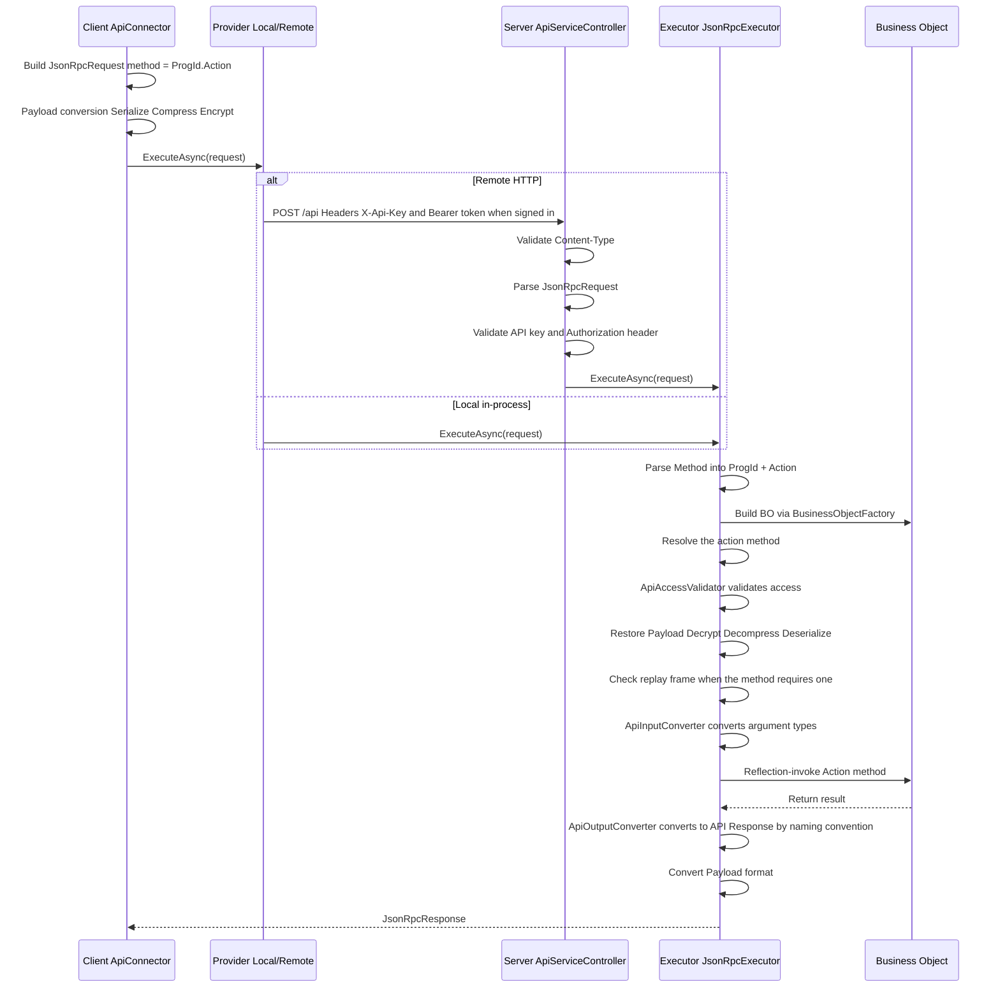

# End-to-End Development Cookbook

[繁體中文](../zh-TW/development-cookbook.md) · [← Docs Index](README.md)

> This document explains the core development flow of the Polhem framework, helping developers (and AI coding tools) understand the full chain from definition to API.

## Framework Initialization Order

The framework registers itself in the standard `IServiceCollection` DI container;
framework services are resolved through ctor injection — there is no static
entry point (service locator).

### Host Startup Flow

```text
┌─────────────────────────────────────────────────────┐
│ 1. paths = new PathOptions { DefinePath = "..." }   │
│ 2. settings = SystemSettingsLoader.Load(paths)      │
│ 3. SysInfo.Initialize(settings.CommonConfiguration) │
├─────────────────────────────────────────────────────┤
│ 4. services.AddPolhemFramework(                     │
│      settings.BackendConfiguration,                 │
│      paths,                                         │
│      autoCreateMasterKey: true)                     │
│    → from Polhem.Hosting (composition root)         │
│    → Registers IDefineStorage / IDefineAccess /     │
│      ICacheContainer / IDbConnectionManager /       │
│      ISessionInfoService / ILanguageService /       │
│      IBusinessObjectFactory / JsonRpcExecutor       │
├─────────────────────────────────────────────────────┤
│ 5. build the provider (builder.Build() in ASP.NET   │
│    Core, services.BuildServiceProvider() elsewhere) │
│ 6. app.UsePolhemFramework() (ASP.NET only —         │
│    startup checks; no middleware or endpoint)       │
└─────────────────────────────────────────────────────┘
```

Host package selection:

- **ASP.NET Core web host**: reference `Polhem.Api.AspNetCore` (it transitively pulls in `Polhem.Hosting`). Add `using Polhem.Hosting;` for `AddPolhemFramework` and `using Polhem.Api.AspNetCore;` for `UsePolhemFramework`. The `POST /api` endpoint is a controller of your own deriving from `ApiServiceController`, so the host also calls `AddControllers()` and `MapControllers()`.
- **Non-ASP.NET Core host** (Console / Worker Service / a desktop app that runs the backend in its own process / integration tests): reference `Polhem.Hosting` directly. No `Microsoft.AspNetCore.App` dependency. To call the backend in process, hand the built provider to the client side: pass it to a connector constructor (`new SystemApiConnector(provider, accessToken)`), or, in a head that uses `Polhem.UI.Core`, assign it to `ClientInfo.LocalServiceProvider`.

`AddPolhemFramework` also registers hosted services, among them the startup registration of the reserved progIds, the cross-process cache-notify poller and the expired-session cleanup. They start only when the provider belongs to a .NET Generic Host (`WebApplication`, `Host.CreateApplicationBuilder`); a provider built with `BuildServiceProvider()` alone does not start them.

Reference implementation: `tests/Polhem.Tests.Shared/TestProcessBootstrap.cs` — applies
the same flow for the test process with `tests/Define/` (merged with the embedded
framework defaults at process start) as the `DefinePath`.

### First-time `DefinePath` setup

Step 1 of the startup flow requires `DefinePath` to exist with the framework's
own define files: `SystemSettings.xml`, `DatabaseSettings.xml`, `DbCategorySettings.xml`,
the `st_*` TableSchemas and the framework's forms (Department, Employee, AuditRule) with
their layouts and language files; `dotnet polhem defines list` prints the full set. The
framework ships these as embedded resources in `Polhem.Definition.dll`; consumers
materialise them once into the target directory before first run.

```bash
# install the framework CLI (one-time, machine-wide)
dotnet tool install -g Polhem.Cli

# materialise framework defaults into your DefinePath
dotnet polhem defines materialize --path ./Define

# tweak SystemSettings (set MasterKeySource) + DatabaseSettings (add connection strings)
# then start the app — DefinePath is now wired up
```

The CLI is a thin shell over `Polhem.Definition.Defaults.MaterializeTo(...)`; the
same API is available programmatically for hosts that prefer to materialise from
code, and `tools/DefineEditor` calls it when you open a folder.
Files that already exist are skipped unless you pass `--overwrite` (`MaterializeOptions.Overwrite`
in code), so re-running keeps your customisations.

See [Framework-Reserved Names](framework-reserved-names.md) for the complete
list of files and consumer extension guidelines.

## Request Processing Pipeline

### Full Request Flow



Access is validated **before** the payload is decrypted, so a call that is not allowed costs no decryption
work (`JsonRpcExecutor.ExecuteAsync`). A request without an `Authorization` header is an anonymous call:
only methods declared `ApiAccessRequirement.Anonymous` accept it, and the others answer JSON-RPC error
`-32001` (Unauthorized).

### Payload Formats

| Format | Pipeline | Use Cases |
|--------|----------|-----------|
| Plain | No transformation | Local calls, dev debugging |
| Encoded | Serialize → Compress | General API calls |
| Encrypted | Serialize → Compress → Encrypt | Sensitive data transmission |

Downgrade rule: when a connector is asked for Encrypted but holds no encryption key yet (before sign-in), it
sends Encoded instead. A method whose `[ApiAccessControl]` requires Encrypted then rejects the call. A connector
using the in-process provider sends Plain unless `SysInfo.IsDebugMode` is on.

## API Contract Three-Tier Separation

The framework separates API types into three tiers, preventing serialization attributes from polluting business logic:

### Tier Mapping

| Tier | Assembly | Base Class | Characteristics |
|------|----------|------------|-----------------|
| Contract | Polhem.Api.Contracts | None (pure interface) | `ILoginRequest`, `ILoginResponse`, etc. |
| API Type | Polhem.Api.Core | `ApiRequest` / `ApiResponse` | Implements Contract interface; no serialization attributes — the MessagePack formatters are hand-written in `src/Polhem.Api.Core/MessagePack/` |
| BO Type | Polhem.Business | `BusinessArgs` / `BusinessResult` | Implements Contract interface, pure POCO |

### Type Conversion Flow

```text
Client sends → LoginRequest (API Type, encoded with the request's codec)
    ↓ JsonRpcExecutor
    ↓ ApiInputConverter property mapping ({Action}Request → {Action}Args)
BO receives → LoginArgs (BO Type, POCO)
    ↓ business logic
BO returns → LoginResult (BO Type, POCO)
    ↓ ApiOutputConverter naming convention ({Action}Result → {Action}Response)
Client receives → LoginResponse (API Type, encoded with the same codec)
```

### Key Components

- **ApiInputConverter** (internal): maps API Request property values to BO Args (matched by property name). A `Plain` body arrives as a `JsonElement` and is read into the action's framework request type (`{Action}Request`) when there is one, or the method's parameter type otherwise, then copied into the BO Args like a decoded body, so it cannot set members the contract does not declare; `object`-typed members such as filter values bind by their JSON kind (string, integer, decimal, boolean, array)
- **ApiOutputConverter**: after execution, automatically maps BO `{Action}Result` to `{Action}Response` via reflection; results cached in `ConcurrentDictionary` (see [ADR-007](../adr/adr-007-convention-based-type-resolution.md))
- The wire body is written by the codec the request declares (`messagepack` or `json`); it plays no part in output mapping. See [ADR-044](../adr/adr-044-payload-codec-negotiation.md).

## ExecFunc Custom Function Pattern

ExecFunc is the framework's extension mechanism, allowing developers to add custom business logic without modifying the framework core.

### Development Steps

The framework's own handlers are internal. An application adds functions with a handler of its own and
dispatches to it from the business object bound to the progId.

#### 1. Write a handler

A handler implements the marker interface `IExecFuncHandler` (`Polhem.Business`). Each public method with the
signature `(ExecFuncArgs args, ExecFuncResult result)` is a function, and its name is the `FuncId` a client sends.
Every such method declares `[ExecFuncAccessControl]` (`Polhem.Business.Attributes`): dispatch rejects a method
without one (`ExecFuncHandlerExtensions.InvokeExecFunc`), and analyzer rule POLHEM3003 reports the omission at
build time. Set `LocalOnly = true` on an operation that must not be reachable from a remote client.

```csharp
using Polhem.Business;
using Polhem.Business.Attributes;
using Polhem.Definition.Collections;   // the ParameterCollection.Add extension
using Polhem.Definition.Security;

public sealed class CustomerFuncHandler : IExecFuncHandler
{
    [ExecFuncAccessControl(ApiAccessRequirement.Authenticated)]
    public void Greet(ExecFuncArgs args, ExecFuncResult result)
    {
        string name = args.Parameters.GetValue<string>("Name", "customer");
        result.Parameters.Add("Greeting", $"Hello, {name}");
    }

    // Maintenance operation: in-process callers only.
    [ExecFuncAccessControl(ApiAccessRequirement.Authenticated, LocalOnly = true)]
    public void RebuildBalances(ExecFuncArgs args, ExecFuncResult result)
    {
        // ...
        result.Parameters.Add("Rebuilt", true);
    }
}
```

#### 2. Dispatch to it from the business object

`ExecFunc` and `ExecFuncAnonymous` call the protected virtual `DoExecFunc` / `DoExecFuncAnonymous` of
`BusinessObject`. Override the one you need in the business object bound to the progId (see "Customising the BO
for a ProgId" below) and invoke the handler, passing the access requirement of that entry point and `IsLocalCall`.
Hand a `FuncId` your handler does not declare to the base implementation, so the framework's own functions stay
reachable:

```csharp
protected override void DoExecFunc(ExecFuncArgs args, ExecFuncResult result)
{
    var handler = new CustomerFuncHandler();
    if (handler.GetType().GetMethod(args.FuncId) is null)
    {
        base.DoExecFunc(args, result);
        return;
    }
    handler.InvokeExecFunc(ApiAccessRequirement.Authenticated, IsLocalCall, args, result);
}
```

The `System` progId works the same way, through a subclass of `SystemBusinessObject` bound in
`ProgramSettings.xml`.

#### 3. Client-side invocation

```csharp
// Form-level: the request goes to the business object of progId "Customer".
var connector = new FormApiConnector(endpoint, accessToken, "Customer");
var response = await connector.ExecFuncAsync(new ExecFuncRequest
{
    FuncId = "Greet",
    Parameters = new ParameterCollection { { "Name", "Contoso" } }
});
string greeting = response.Parameters!.GetValue<string>("Greeting");
```

System-level functions go through `SystemApiConnector.ExecFuncAsync` in the same way. The framework's own system
functions `UpgradeTableSchema` and `TestConnection` are `LocalOnly`, so only a connector that dispatches in
process — one constructed with the backend's `IServiceProvider` — can run them:

```csharp
var sysConnector = new SystemApiConnector(serviceProvider, accessToken);
var upgrade = await sysConnector.ExecFuncAsync(new ExecFuncRequest
{
    FuncId = "UpgradeTableSchema",
    Parameters = new ParameterCollection
    {
        { "DatabaseId", "company01" },
        { "CategoryId", "company" },
        { "TableName", "ft_customer" }
    }
});
bool upgraded = upgrade.Parameters!.GetValue<bool>("Upgraded");
```

### Execution Flow

```text
Client: await connector.ExecFuncAsync(new ExecFuncRequest { FuncId = "Greet" })
  → ApiConnector.ExecuteAsync<ExecFuncResponse>("ExecFunc", request)
  → JsonRpcRequest { method: "Customer.ExecFunc" }
  → JsonRpcExecutor calls CustomerBo.ExecFunc()        // BusinessObject.ExecFunc
  → CustomerBo.DoExecFunc()                            // your override
  → handler.InvokeExecFunc(...)                        // ExecFuncHandlerExtensions
    → handler.GetType().GetMethod("Greet")             // reflection lookup
    → no [ExecFuncAccessControl] → rejected
    → LocalOnly and a remote caller → rejected
    → Authenticated method on the anonymous entry point → rejected (-32001)
    → method.Invoke(handler, args, result)
  → return ExecFuncResult
```

## FormSchema-Driven Development

FormSchema is the framework's definition hub, simultaneously driving UI, database, and validation rules.

### Core Concept

```text
FormSchema (Single Source of Truth)
├── ProgId: "Customer"
├── DisplayName: "Customers"
├── CategoryId: "company"       ← required: common / company / log
├── Tables: FormTableCollection
│   ├── Master: FormTable (TableName equals ProgId)
│   │   ├── TableName: "Customer"
│   │   ├── DbTableName: "ft_customer"
│   │   └── Fields: FormFieldCollection
│   └── Detail: FormTable (detail table)
│       ├── TableName: "CustomerContact"
│       ├── DbTableName: "ft_customer_contact"
│       └── Fields: FormFieldCollection
│
├── → derives TableSchema (database dimension)
├── → derives FormLayout at design time (UI dimension)
└── → drives IFormCommandBuilder family (SQL generation)
```

### CategoryId and DbCategory Routing

Every FormSchema must specify `CategoryId`, which corresponds to the `Id` of a `<DbCategory Id="...">` in `DbCategorySettings.xml`. It accepts only `common`, `company` and `log`: the form repository maps the value to a `DbScope` and throws `InvalidOperationException` ("Unknown schema.CategoryId") for anything else. `CategoryId` simultaneously determines:

- TableSchemas derived from this FormSchema are persisted under the `TableSchema/{categoryId}/` subdirectory
- Which database the tables of this FormSchema live in (`CategoryId` → `DbScope` → `IRepositoryDatabaseRouter`)

Business tables (`ft_*`) belong in `company`, the per-company database. `common` holds the framework tables shared across companies, and `log` the audit and anomaly logs. The framework ships its own `Employee` and `Department` forms (company tables `st_employee` / `st_department`), so an application does not reuse those progIds; see [Framework-Reserved Names](framework-reserved-names.md).

`SaveFormSchema` validates that `CategoryId` is non-empty (via `TableSchemaGenerator.GetCategoryId(formSchema)`); throws `InvalidOperationException` when missing.

### Resolving DatabaseId in a BO Method

A BO method should never hard-code a `databaseId` string or read `SessionInfo.CompanyId` / `CompanyInfo` directly. Use the `BusinessObject` base helpers instead:

```csharp
// FormSchema-driven CRUD — one-liner, auto-routed
var repository = CreateDataFormRepository(ProgId);
// Equivalent to:
// Services.GetRequiredService<IRepositoryFactory>()
//         .CreateFormRepository<IDataFormRepository>(AccessToken, ProgId);

// Custom bo repo — resolve databaseId for the target scope, then build the repo
var logDbId = ResolveDatabaseId(DbScope.Log);         // "log" (no session needed)
var companyDbId = ResolveDatabaseId(DbScope.Company); // routes via session.CompanyId → CompanyInfo.CompanyDatabaseId
var repo = new MonthlySalesReportRepo(Services.GetRequiredService<IDbAccessFactory>(), companyDbId);
```

`DbScope` resolution rules:

| `DbScope` | Resolved `databaseId` | Requires session? |
|-----------|----------------------|-------------------|
| `Common` | Fixed `"common"` | No |
| `Log` | Fixed `"log"` | No (Login / Logout etc. can write audit log pre-EnterCompany) |
| `Company` | `SessionInfo.CompanyId` → `CompanyInfo.CompanyDatabaseId` | Yes — throws `AuthenticationRequiredException` without a session and `CompanyNotEnteredException` before `EnterCompany` |

See [ADR-010 § "Later extension: runtime routing"](../adr/adr-010-logical-database-category.md) for the routing design and [ADR-012](../adr/adr-012-session-company-context.md) for the session lifecycle that drives `DbScope.Company`.

### Customising the BO for a ProgId

The framework instantiates `FormBusinessObject` by default for every `ProgId`. When a form needs behaviour that goes beyond the FormSchema-driven CRUD pipeline (custom validation, domain events, AnyCode SQL, etc.), subclass `FormBusinessObject` and bind the subclass through `ProgramSettings.xml`.

#### 1. Subclass `FormBusinessObject`

```csharp
namespace MyErp.Business;

public class CustomerBo : FormBusinessObject
{
    public CustomerBo(IBusinessObjectContext ctx, Guid accessToken, string progId, bool isLocalCall = false)
        : base(ctx, accessToken, progId, isLocalCall) { }

    // Override a Do* hook (see the next section) or add custom methods
    // exposed via [ApiAccessControl].
    protected override void DoBeforeSave(SaveContext context)
    {
        base.DoBeforeSave(context);
        // custom validation or computed values
    }
}
```

#### 2. Bind the subclass in `ProgramSettings.xml`

```xml
<ProgramItem ProgId="Customer"
             DisplayName="Customer Management"
             BusinessObject="MyErp.Business.CustomerBo, MyErp.Business" />
```

`BusinessObject` uses the assembly-qualified format (`"Namespace.Type, AssemblyName"`). When empty, the resolver falls back to `FormBusinessObject` — so you only need to declare `BusinessObject` for the ProgIds that actually need customisation.

#### 3. Resolution behaviour

`ProgramSettingsBoTypeResolver` (registered by `AddPolhemFramework`) looks up `ProgramItem.BusinessObject`, loads the type via `AssemblyLoader`, and verifies it derives from `BusinessObject`. **A declared name that will not resolve throws** — an unloadable type, or one with the wrong base class, is a configuration error with no harmless reading. Falling back would buy only the appearance of a running system: `FormBusinessObject` accepts any progId, so it constructs happily and the failure surfaces later as generic behaviour where custom logic was expected.

Incremental adoption is still safe, because **declaring nothing is not a failure**: a progId the registry does not mention, or one whose `BusinessObject` is empty, resolves to `FormBusinessObject` as before. Only declare `BusinessObject` for the progIds you actually customise.

The **reserved progIds** (`ReservedProgIds.All`: `System`, `AuditLog`, `AuditRule`) follow the same policy with a tighter base-type constraint: `System` and `AuditLog` must resolve to the framework object for that axis or a subclass of it, and `AuditRule` to a `FormBusinessObject`. When one of them has no entry, the resolver uses the framework's own type, and at startup a Generic Host writes the missing entries to the registry (`SaveProgramSettings`), so an existing `ProgramSettings.xml` needs no manual edit.

A resolved type is reused only while the `ProgramSettings` instance it was resolved from is still the cached one; after the file changes and the definition cache loads a new instance, the next call resolves again.

### BO Extension Points and the Transaction Boundary

`Save` and `Delete` are each split into three overridable steps. **Override one of those, not the
public method** — the authorization and record-scope checks live in the public method, and replacing
it takes them over too.

```text
Save:   DoBeforeSave  →  DoSave  →  [change audit]  →  DoAfterSave
Delete: DoBeforeDelete → DoDelete → [delete audit]  → DoAfterDelete
                          ↑
                only this step runs inside the database transaction
```

The transaction is opened and committed by the repository, within `DoSave` / `DoDelete`. Everything
else — including work you add around `base.DoSave(context)` in an override — runs outside it.

That boundary is deliberate: `DoBeforeSave` evaluates expressions, reads lookups and may call other
business objects, while `DoAfterSave` is where notifications and calls to other systems belong.
Holding a transaction open across those ties lock duration to external latency, which is how
connection pools drain and distributed deadlocks appear.

#### Aborting the operation

Throw `UserMessageException` (`Polhem.Base.Exceptions`) — the framework's business-flow interruption
signal. It travels to the client as `JsonRpcErrorCode.UserMessage` and is rebuilt there as the same type,
so its message reaches the end user. Any other exception reaches a remote caller only as a fixed, generic
message. The schema-driven rule engine uses the same mechanism for its `BeforeSave` validation rules.

For a message that should follow the user's language, use the keyed constructor: a language key
(`"{namespace}.{subKey}"`), the English text as a composite format, and its arguments.

```csharp
protected override void DoBeforeSave(SaveContext context)
{
    base.DoBeforeSave(context);
    if (/* business condition fails */)
        throw new UserMessageException(
            "Customer.CreditLimitExceeded",
            "The credit limit of {0} has been exceeded.",
            creditLimit);
}
```

Before the error leaves the server, the key is looked up in the deployment's language resources (namespace
`Customer`, item `CreditLimitExceeded`) in the session's culture, walking the same fallback chain as every
other lookup (`LanguageFallback`: the culture, its parent cultures, then `CommonConfiguration.DefaultLanguage`,
except that an English culture stops at the English text). When no culture on the chain translates the key,
the English text is sent. The constructors without a key send their message as written.

#### Three consequences to design around

**Validation in `DoBeforeSave` has a time-of-check to time-of-use gap.** A read that finds stock
sufficient can be invalidated by another transaction before `DoSave` runs, and the save still
proceeds. Throwing an exception settles *how* to abort; it does not make the check current at write
time. Checks that must be atomic belong inside the transaction or the database — a conditional UPDATE,
a unique index, or a check constraint. Reads in `DoBeforeSave` are for rejecting obviously wrong input,
not for guarding against concurrency.

**The change audit is not atomic with the data.** It is written after `DoSave` returns, so a record
can persist while its audit entry fails. Raising the audit into the transaction would make `DoSave`
more than persistence and require a transaction API at the business-object layer; the framework
accepts the gap instead.

**A failure in `DoAfterSave` leaves the data saved.** The exception propagates and the call reports
failure, but the transaction committed before that step began. Side effects placed there must
tolerate being retried, or be handed to a queue rather than performed inline — a notification sent
synchronously and then failing leaves nothing to retry from.

#### When logic must be atomic with the record

`DataFormRepository.Save` is not virtual and offers no hook for adding statements to its transaction,
which `DbAccess.UpdateDataTables` opens and commits. What commits atomically with the record is therefore
either enforced by the database (unique indexes, check and foreign key constraints) or written by a write
path you own: a method on a custom repository (see "Customising the Repository for a ProgId" below) that
opens a connection, begins a `DbTransaction`, runs every statement through
`new DbAccess(connection, databaseType).Execute(command, transaction)` and commits once — the pattern the
framework's own repositories use. A `DoSave` override then calls it in place of `base.DoSave(context)` and
sets `context.RefreshedDataSet` and `context.AffectedRows` itself.

### Business Plugins

Subclassing replaces the business object; a **plugin** adds a step to the one that is already
there. Use it when the customization is an addition — a check before saving, a notification after
— and subclassing when you need to intercept or replace what the framework does.

| Need | Mechanism | What it can do |
|------|-----------|----------------|
| Intercept or replace existing logic | Subclass the BO, override a `Do*` step | Wrap `base.DoXxx()` on both sides, or skip it entirely |
| Append to existing logic | Plugin | One control point, after the step |

Both can be used together: a plugin runs after the step's final implementation, whether that is the
framework's or a custom subclass's.

#### Writing one

Derive from `FormBusinessPlugin` and override the one stage the plugin runs at. **A plugin binds to
exactly one stage** — a requirement spanning two of them is two classes.

```csharp
public class CreditLimitPlugin : FormBusinessPlugin
{
    public CreditLimitPlugin(IBusinessObjectContext ctx, Guid accessToken, string progId)
        : base(ctx, accessToken, progId) { }

    public override void BeforeSave(SaveContext context)
    {
        if (/* over the limit */)
            throw new UserMessageException(
                "Customer.CreditLimitExceeded", "The credit limit of {0} has been exceeded.", creditLimit);
    }
}
```

The constructor takes the per-call business context, the access token and the progId, and may declare
further dependencies after them — they are injected from the container.

#### The four stages

| Stage | Runs | Sees |
|-------|------|------|
| `BeforeSave` | After the rule engine, **before the audit snapshot** | `SaveContext`; the data set may still be changed |
| `AfterSave` | After persistence and the change audit | `SaveContext` with `RefreshedDataSet` and `AffectedRows` |
| `BeforeDelete` | After the guard rules, before deletion | `DeleteContext` with `Snapshot` |
| `AfterDelete` | After deletion and the delete audit | `DeleteContext` with `Snapshot` and `RowsAffected` |

`BeforeSave` is the only stage at which a plugin can safely change data: it precedes both the audit
snapshot and persistence, so a change made there is written **and** audited. In `AfterSave` the
record is already saved — changing `DataSet` does nothing, while changing `RefreshedDataSet` alters
what the caller receives.

**Every stage runs outside the database transaction**, which covers `DoSave` / `DoDelete` alone.
See "BO Extension Points and the Transaction Boundary" above for what follows from that.

#### One class, one stage

A class must override exactly the stage its binding declares — no more, no fewer. "Check before
saving, then act afterwards" is therefore two classes, and **there is no shared state between
them**: what the `After` class needs it has to read or recompute. That is the price of a definition
file you can read for what runs where.

Plugins are constructed on demand — a plugin is created the first time its own stage runs, and not
at all otherwise, so a save never constructs a delete-stage plugin. Instances are per operation and
never shared between calls, so no locking is needed.

#### Binding them

Plugins are bound per progId, per tenant, in `{CustomizePath}/{customizeId}/PluginSettings.xml`.
**Declaration order is execution order** — there is no priority number.

```xml
<PluginSettings>
  <Items>
    <ProgramPluginItem ProgId="Order">
      <Plugins>
        <PluginItem Type="MyErp.Plugins.CreditLimitPlugin, MyErp.Plugins" Stage="BeforeSave" />
        <PluginItem Type="MyErp.Plugins.OrderSyncPlugin, MyErp.Plugins"   Stage="AfterSave" />
      </Plugins>
    </ProgramPluginItem>
  </Items>
</PluginSettings>
```

`Stage` is required, and it is checked against the class when the chain is built: the class must
override that stage and no other. **Changing which stage a class overrides therefore means changing
this file as well** — otherwise the next resolution throws, naming the stage the class actually
overrides. The alternative would be running a stage the file does not name, which is the thing the
declaration exists to prevent.

A base-layer file at `{DefinePath}/PluginSettings.xml` is also read, and the two **add up**: the
base chain runs first, then the tenant's. A tenant therefore cannot suppress a packaged plugin —
to remove packaged behaviour, subclass the business object and override the step.

Maintain the tenant file through `SystemBusinessObject.GetCustomizePluginSettings` /
`SaveCustomizePluginSettings` (`SystemApiConnector.GetCustomizePluginSettingsAsync` /
`SaveCustomizePluginSettingsAsync` on the client). Both are `LocalOnly`: these bindings decide which code
runs inside the save and delete pipelines, so the maintenance tool runs on the host, in-process. Saving
validates every binding — the type must load, derive from `FormBusinessPlugin`, and override exactly
the stage the binding declares — and one bad entry rejects the whole definition.

#### Failure, and side effects that reach other systems

Throwing aborts the operation, exactly as it does from a `Do*` override; use
`UserMessageException` for a message meant for the end user.

At an `After` stage the data is already committed, so throwing fails the call against saved data.
That matters most for the common case of propagating a change to another system:

| Reliability required | Where it belongs |
|---|---|
| Must not be lost (finance, stock, external commitments) | Write an outbox row in the same transaction as the record, through a write path you own (see "When logic must be atomic with the record"), and send from a background worker |
| Best effort, or a reconciliation job catches misses | An `AfterSave` / `AfterDelete` plugin sending directly |

A plugin talking to another system should also decide for itself whether a failure warrants
aborting the user's operation. The framework's default is "throwing aborts", because validation
plugins need it — but do not let a remote system's availability determine whether a record can be
saved.

#### Plugins versus schema rules

Both extend a form's behaviour, so the dividing line is worth stating:

| | Schema rules (`FormSchema`) | Plugins |
|---|---|---|
| Stored in | The form schema — **not customizable** | `PluginSettings.xml` — per tenant |
| Written as | Declarative expressions | Compiled types |
| Suited to | Field defaults, computed fields, validation | Cross-table and cross-system side effects |
| Deployed by | Editing a definition | Shipping an assembly |

### Customising the Repository for a ProgId

Data access is bound the same way, on the same registry entry. Subclass `DataFormRepository`, declare the members the business object needs on an interface extending `IDataFormRepository`, and name the type in `ProgramItem.Repository`:

```csharp
public interface IOrderRepository : IDataFormRepository
{
    string GetStoredStatus(Guid rowId);
}

public sealed class OrderRepository : DataFormRepository, IOrderRepository
{
    public OrderRepository(IRepositoryContext ctx, Guid accessToken, string progId)
        : base(ctx, accessToken, progId) { }

    public string GetStoredStatus(Guid rowId)
    {
        var spec = new DbCommandSpec(DbCommandKind.Scalar,
            "SELECT status FROM ft_order WHERE sys_rowid = {0}", rowId);
        return CreateDbAccess().Execute(spec).Scalar as string ?? string.Empty;
    }
}
```

```xml
<ProgramItem ProgId="Order"
             DisplayName="Orders"
             BusinessObject="MyErp.Business.OrderBo, MyErp.Business"
             Repository="MyErp.Repositories.OrderRepository, MyErp.Repositories" />
```

The business object asks for it by interface, with no cast and no database id to name — the binding comes from the registry and the routing from the form schema's `CategoryId`:

```csharp
private IOrderRepository Repository() => CreateFormRepository<IOrderRepository>();
```

**As with `BusinessObject`, a `Repository` that will not load throws.** Data access has no harmless degraded mode: falling back would run this program's reads and writes through the generic SQL its author replaced on purpose, and the failure would surface later with the data already wrong. An *empty* `Repository` declares nothing and keeps the framework's own.

A subclass may add its own dependencies — the factory builds it with `ActivatorUtilities`, so interface-typed constructor parameters are injected from DI. It must not add a second `string` or `Guid` parameter, since those are already supplied by the factory.

A subclass adds members; it does not change the inherited ones. `DataFormRepository`'s `GetList`, `GetData`, `Save`, `Delete` and the other `IDataFormRepository` members are not virtual. The protected `CreateDbAccess()`, `DatabaseId` and `Context` (connection manager, cache-notify service) are what its own members build on.

### FormSchema → SQL Generation

```text
FormApiConnector.GetListAsync(...)
  → FormBusinessObject.GetList handles the request
  → DataFormRepository (bound to the progId) runs the query
    → IFormCommandBuilder, created for the connection's database type by
      DbDialectRegistry.Get(databaseType).CreateFormCommandBuilder(formSchema, defineAccess)
    → BuildSelect(tableName, selectFields, filter, sortFields, ...)
      → SelectCommandBuilder.Build(...)
        → SelectBuilder: produce SELECT field list
        → FromBuilder: produce FROM clause (with JOINs for relation fields)
        → WhereBuilder: produce WHERE clause from the FilterNode tree
        → SortBuilder: produce ORDER BY clause
    → returns parameterized DbCommandSpec
  → DbAccess.Execute(spec) executes the query
```

### FilterCondition Query Construction

```csharp
// Build a filter: all three conditions must hold
FilterNode filter = FilterGroup.All(
    FilterCondition.Equal("region", "North"),
    FilterCondition.Contains("sys_name", "Trading"),
    FilterCondition.Between("credit_limit", 30000m, 80000m));

var list = await formConnector.GetListAsync(selectFields: "sys_id,sys_name", filter: filter);
```

`FilterGroup.All` combines with AND and `FilterGroup.Any` with OR; groups nest. `FilterCondition` has factory
methods for `Equal`, `NotEqual`, `Contains`, `StartsWith`, `EndsWith`, `Between` and `In`; every other
operator of `ComparisonOperator` (for example `GreaterThan`) goes through the constructor
`new FilterCondition(fieldName, ComparisonOperator.GreaterThan, value)`. Field names are the form's field
names, and `GetList` refuses a filter or sort on a field the form does not declare.

## Numeric Semantics, Company Decimals, and Rounding

Numeric fields declare a semantic **`NumberKind`** on `FormField` (propagated to `LayoutFieldBase`). The kind drives three things — the display format, whether the value is rounded on write, and where the decimal places come from. The members, framework defaults, and the design rationale (why round-then-sum, why amounts resolve at runtime, why DB scale is orthogonal) are the signed-off contract in [ADR-026](../adr/adr-026-numeric-semantics-rounding.md).

| `NumberKind` | Rounding policy | Decimals source | Framework default | Use |
|-------------|-----------------|-----------------|:-----------------:|-----|
| `Quantity` / `Weight` | `Round` | `Unit` (a `UnitField` is required) | 0 / 3 | quantities, weights |
| `Amount` | `Round` | `Currency` (falls back to company) | 2 | amounts, tax, totals |
| `Percent` | `Round` | `Company` | 2 | percentages |
| `UnitPrice` / `Cost` | `Preserve` | `Company` (display-only) | 4 | prices, costs |
| `ExchangeRate` | `Preserve` | `SystemFixed` | 5 | exchange rates |

### Two rules that are easy to get wrong

- **Round-then-sum (total invariant).** For `Round` kinds, a total must equal the **sum of already-rounded details**, never a full-precision sum rounded once at the end. Round each detail with `NumberFormatResolver.RoundByKind(value, kind, company)` — or the reference-aware `RoundByKind(value, kind, ctx, refCode)` for amounts and for quantities/weights, passing their currency or unit code (below) — then add the rounded values. This guarantees `Σ details == total`.
- **Preserve never writes a rounded value.** `UnitPrice` / `Cost` / `ExchangeRate` are stored at input precision; their decimals are display-only. `RoundByKind` returns these values unchanged. Rounding a source value injects error downstream — do not do it. (For API import, the only hard boundary is DB scale; see the persistence-boundary decision D6 in [ADR-026](../adr/adr-026-numeric-semantics-rounding.md).)

### Display format is baked at delivery

The definition APIs serve a `FormSchema` exactly as stored, so baking is the consuming side's job: in the .NET heads, `FormDefinitionLoader.GetLocalizedSchemaAsync` (`Polhem.Api.Client`) clones the cached schema and calls `NumberFormatApplier.Bake(clone, company)`, which sets `FormField.NumberFormat` (e.g. `"N2"`, `"P4"`, `"N5"`) on every company- or system-sourced `NumberKind` field that has no explicit format. Amounts and quantities/weights are not baked; they resolve per row from their currency or unit. An author-supplied `NumberFormat` always wins. The cached schema is never mutated — baking runs on the per-call clone only (see the remarks on that method).

Because the format is resolved from the session company's decimals, the same schema delivered to two companies can carry different formats (e.g. `Percent` at `P2` vs `P4`). `SystemFixed` kinds (`ExchangeRate`) ignore any company override and always use the framework default.

### Multi-currency: amounts resolve by their currency at runtime

`Amount` decimals follow the **currency**, not the company (JPY = 0, USD = 2, BHD = 3 — like SAP TCURX). The currency master is the system-level define **`CurrencySettings`** (`DefineType.CurrencySettings`, curated ISO 4217 table; each `CurrencyItem` carries a `Rounding` natural minor unit from which decimals are derived). It ships to the client through the ordinary `GetDefine` channel; a missing master is fine — amounts then fall back to the framework default of 2.

Each amount field binds a **currency key field** (SAP CUKY) via `FormField.CurrencyField`; the master document currency lives on `FormSchema.CurrencyField` (by convention `sys_currency`). The resolution priority for an amount's currency is: **explicit `CurrencyField` → master `sys_currency` → company `DefaultCurrency`**. The company default currency is required — a company without one makes the resolver throw `InvalidOperationException` rather than guess; only with no company context at all (for example before a company is entered) does an amount fall back to the framework default of 2. Detail amount fields read the master row's currency. At delivery, `Bake` **does not bake** `Amount` formats (their decimals depend on the runtime currency value — the UI resolves them per row); it instead stamps the effective currency-reference field onto each amount field so the UI knows what to watch.

Server-side rounding uses the currency-aware overloads with a `RoundingContext` (`Company` + `CurrencySettings`):

- **Per-detail:** `NumberFormatResolver.RoundByKind(value, NumberKind.Amount, ctx, currencyCode)` rounds to the currency's natural decimals. Round-then-sum as usual — original and home amounts each round to their own currency independently.
- **Home currency:** `home_amount = RoundByKind(amount × rate, Amount, ctx, homeCurrency)` — the already-rounded original amount times the full-precision (preserve) rate, rounded to the home currency's decimals. The home currency defaults to `CompanyInfo.DefaultCurrency`.
- **Final cash rounding (optional):** `RoundCash(total, currencyCode, ctx)` snaps the final payable to the company's per-currency cash-rounding unit (SAP T001R, `CompanyInfo.CashRounding`, e.g. CHF → 0.05); with no override it stays at the currency's natural unit (no extra rounding). The deliberate difference `payable − total` is booked to a rounding account by the caller.

The currency decimals are **system-wide** (in `CurrencySettings`); only the **cash-rounding unit** is company-overridable (`CompanyInfo.CashRounding`). The per-company `CompanyInfo.AllowedCurrencies` whitelist bounds which currencies a document may pick (empty = all system currencies).

### Units of measure: quantities/weights resolve by their unit at runtime

`Quantity` / `Weight` decimals follow the **unit of measure**, not the company (KG = 3, PCS = 0 — like SAP T006), exactly parallel to amounts and currency. The unit master is the system-level define **`UnitSettings`** (`DefineType.UnitSettings`, curated table; each `UnitItem` stores its `Decimals` directly). It ships to the client through the ordinary `GetDefine` channel; a missing master falls back to the framework default.

Each quantity/weight field **must** bind a **unit field** (SAP UNIT) via `FormField.UnitField` (there is no master-level unit — units are per row, and the unit field is read from the same row). A value that needs no unit — a count whose unit is implied — is a plain numeric field with no `NumberKind`. `NumberFormatResolver` never takes these decimals from the company: a company has a home currency to fall back to, but no default unit.

| Case | `RoundByKind(value, kind, ctx, unitCode)` |
|------|------|
| The unit code is found in `UnitSettings` | Rounds to that unit's decimals |
| The row's unit code is empty | Returns the value unchanged |
| The unit code is not in `UnitSettings`, or no unit master is deployed | Rounds to the framework default for the kind |
| A computed quantity/weight field has no `UnitField` | `FormExpressionCalculator` throws `InvalidOperationException` |

`Bake` never bakes quantity/weight fields. Server-side rounding passes a `RoundingContext` carrying `UnitSettings`; round-then-sum holds per unit (a mixed-unit column has no meaningful total). The grid and `NumericEdit` resolve the unit per cell/row the same way as currency. `AmountColumnSummary` can gate a footer total that mixes units, but the grid has no footer of its own — the host wires it (see the DemoCenter `MultiUnitModule`).

### DB storage precision is a capacity ceiling, not a display/calc setting

Numeric columns use `Decimal` with a single framework-wide high scale (e.g. `Scale=8`), independent of any company or currency decimals — so there is no per-company/per-currency `ALTER`. The display decimals (`NumberFormat`) and the calculation decimals (`RoundByKind`) are orthogonal to the DB scale; the scale only bounds how much precision the column can hold.

## Cross-Process Cache Invalidation

In-process caches (`Polhem.ObjectCaching`) are evicted immediately on the writing process (`SaveX → Remove()`). To propagate an invalidation to **other processes / nodes** — required for multi-node deployments and for caches backed by the database (e.g. `CompanyInfo`, or definitions under `DbDefineStorage`) — use the database-backed notification mechanism. Design rationale is in [ADR-017](../adr/adr-017-db-cache-invalidation.md) and the mechanism in full is in [Caching](caching.md); this section covers practical usage.

### Making a cache invalidatable — nothing to do

A cache built on `ObjectCache<T>` or `KeyObjectCache<T>` participates in cross-process invalidation by default. When its `GetPolicy()` leaves `ChangeNotifyKey` unset, the base class applies `"{CacheGroup}:*"` (single-object cache) or `"{CacheGroup}:{key}"` (keyed cache), where `CacheGroup` defaults to the cached type's name. Entries carrying the key are given an expiration token bound to the key's published version.

Set the key yourself only when the cache should listen to a different one:

```csharp
policy.ChangeNotifyKey = changeSource.NotifyKey;
```

### Triggering an invalidation — bump in the same transaction

When a writer changes source data in a way that matters to a cache, it bumps the notification row **in the same transaction as the data change**:

```csharp
// "group:entity" key whose group equals the target cache's CacheGroup (its type name by default)
_cacheNotify.Touch($"CompanyInfo:{companyId}", transaction, databaseType);
```

Conventions for the `"group:entity"` key:

- **group** = the cache's `CacheGroup`, which is the cached type's name unless the cache overrides it (`CompanyInfo`, `FormSchema`, `LanguageResource`, …).
- **entity** = exactly the key the cache's `Remove` uses. Single-key caches pass the key as-is (`progId`, `layoutId`); composite-key caches use the **dot** form (`TableSchema` → `"common.st_user"`, `LanguageResource` → `"zh-TW.common"`); single-object caches use `"*"` (`"DbCategorySettings:*"`).

> ⚠️ The bump **must** commit in the same transaction as the data change. Committing it separately lets the poller observe the new version before the data is visible, which reloads a stale value and marks it fresh — permanently stale. `DbDefineStorage.SaveX` already does this; a custom repository passes its write `DbTransaction` to `Touch` (the service is `ICacheNotifyService`, available to repositories as `Context.CacheNotify`, which is `null` when the host registers none).

### How eviction reaches other nodes

`CacheNotifyPoller` (a hosted service) on each node polls `st_cache_notify` every `IntervalSeconds`, detects keys whose `cache_version` advanced (incremental fetch by `sys_update_time`, idempotent by version), and publishes the new version via `CacheInfo.NotifyVersions`. Entries whose `ChangeNotifyKey` matches see a version different from the one they captured and expire on the next read, which reloads from source (lazy). Nothing is pushed and no entry is touched eagerly: every node independently polls the same table.

### Configuration (`BackendConfiguration.CacheNotifyOptions`)

| Key | Default | Notes |
|-----|---------|-------|
| `Enabled` | `true` | Registers the poller. A pure **single-process** single-node deployment may disable it (local writes evict immediately). Multiple processes on one machine still need it. |
| `IntervalSeconds` | `5` | Polling interval; effectively the cross-node staleness bound. Each poll is one indexed query that usually returns zero rows, so the load cost is negligible — tune by latency tolerance, not cost. |
| `MarginSeconds` | `5` | Overlap look-back covering long-transaction boundary cases. |
| `DatabaseId` | `common` | Database whose `st_cache_notify` is polled. |

> The mechanism uses the **database server clock only** (never the app clock) and never converts time zones, so it is correct regardless of host time zone. Set the database server to **UTC** so stored `sys_update_time` values are UTC (see [ADR-017](../adr/adr-017-db-cache-invalidation.md)).

## Frontend API Connection Patterns

The two .NET UI families consume the API in structurally different ways. For the design rationale see [ADR-013](../adr/adr-013-frontend-api-connection-strategy.md); this section covers the **practical usage** of each. Which platforms each one runs on, and what a browser or mobile head has to set up, is in [Platform Support](platform-support.md).

### Decision Tree

> Which category does your frontend belong to?

```
What kind of frontend are you building?
│
├── Avalonia (desktop, browser, iOS, Android), or your own WinForms / WPF host
│   → Use the Polhem.UI.* family via the ClientInfo static singleton
│   → See "Polhem.UI.* heads" below
│
├── Blazor Server (ASP.NET Core server-rendered)
│   → Use Polhem.Web.Blazor.Server with circuit-scoped connectors
│   → See "Blazor Server" below
│
└── No .NET (JavaScript, TypeScript, …)
    → Call the JSON-RPC endpoint directly
    → See JSON-RPC Frontend Integration
```

> The framework ships two UI packages: `Polhem.UI.Avalonia` and `Polhem.Web.Blazor.Server`.
> Any other .NET frontend — WinForms, WPF, a Blazor WebAssembly app of your own — has no framework UI
> package and uses `Polhem.UI.Core` (`ClientInfo`) or `Polhem.Api.Client` directly. A client without .NET
> follows [JSON-RPC Frontend Integration](jsonrpc-frontend-integration.md).

### Polhem.UI.* heads (ClientInfo)

These heads manage connection state through the `Polhem.UI.Core.ClientInfo` static singleton, which fits the "one process = one user" model. The code below is the same in every head that uses it: the Avalonia desktop, browser (WebAssembly), iOS and Android heads, and a WinForms or WPF host of your own. What differs per platform is setup — the endpoint and API key storage in the browser, the publish settings, and which connection types apply — and that is covered by [Platform Support § Checklist for a browser or mobile head](platform-support.md#3-checklist-for-a-browser-or-mobile-head). A Local connection (the backend in the same process) is a desktop option; the browser and mobile heads connect Remote.

**1. Call `InitializeAsync` at app startup**:

```csharp
// MyApp/Program.cs (or App.axaml.cs, etc.)
using Polhem.Api.Client;
using Polhem.UI.Core;

// 1. Implement IUIViewService (provides the connection settings dialog)
public sealed class MyUIViewService : IUIViewService
{
    public async Task<bool> ShowApiConnectAsync()
    {
        // Ask the user for the endpoint with your own dialog (an Avalonia view, a WinForms Form, …).
        string? endpoint = await ShowEndpointDialogAsync();
        if (endpoint is null) { return false; }      // the user cancelled
        await ClientInfo.SetEndpointAsync(endpoint);  // validates, connects and stores it
        return true;
    }
}

// 2. Initialize at startup — the accessors are asynchronous end-to-end, so await it.
var supportedConnectTypes = SupportedConnectTypes.Remote; // Both allows Local as well (desktop only)
if (!await ClientInfo.InitializeAsync(new MyUIViewService(), supportedConnectTypes))
{
    // The user cancelled connection setup; exit the app.
    return;
}
```

`InitializeAsync` reads the stored endpoint from `ClientInfo.EndpointStorage`, validates it and initializes the system connector; when the endpoint is missing or unreachable it calls `IUIViewService.ShowApiConnectAsync()`. The default storage is `FileEndpointStorage` (`Polhem.UI.Core`), which keeps the endpoint and the API key in a folder named after the entry assembly under the per-user local application data directory. An `Endpoint=<url>` or `ApiKey=<key>` command-line argument overrides the stored value for that run. A browser head replaces both `ClientInfo.EndpointStorage` and `ClientInfo.ApiKeyStorage`, because WebAssembly has no persistent file system.

**2. Sign in, apply the result, enter a company**:

```csharp
var loginResponse = await ClientInfo.SystemApiConnector.LoginAsync(userId, password);
ClientInfo.ApplyLoginResult(loginResponse);
// ClientInfo.AccessToken / UserInfo are now populated

var enterResponse = await ClientInfo.SystemApiConnector.EnterCompanyAsync(companyId);
ClientInfo.ApplyEnterCompanyResult(enterResponse);
// ClientInfo.Company / Capabilities are now populated
```

`ApplyLoginResult` also makes the culture the server returns — the user's `st_user.culture`, or the deployment's `CommonConfiguration.DefaultLanguage` — the process's current and default culture. The framework's own UI text, localized definition captions and the display and input of numbers and dates all read it, so a user whose account says `en-US` gets English on a Chinese operating system. Forms whose `CategoryId` is `company` need `EnterCompany` first; before it, their calls fail with `CompanyNotEnteredException`.

**3. Use connectors via `ClientInfo`**:

```csharp
// System-level API
PingResponse ping = await ClientInfo.SystemApiConnector.PingAsync();

// Form-level API (FormBO)
var formConnector = ClientInfo.CreateFormApiConnector("Customer");
var listResult = await formConnector.GetListAsync(selectFields: "sys_id,sys_name");

// Definition data (FormSchema, TableSchema, etc.), exactly as stored
FormSchema schema = await ClientInfo.DefineAccess.GetFormSchemaAsync("Customer");
```

`GetListAsync` without paging options returns the first page of `PagingOptions.MaxPageSize` rows; pass a `PagingOptions` to page through more. `ClientInfo.DefineAccess` returns definitions as stored, with no localization or tenant overlay. The Avalonia `FormView`, `ListView` and `LookupDialog` load their definitions through `ClientInfo.DefinitionLoader` instead — captions in the user's language, the tenant's customization layer and the company's number formats — and code can call `ClientInfo.DefinitionLoader.GetLocalizedSchemaAsync(progId, CultureInfo.CurrentUICulture.Name)` itself. `ClientInfo.UseDefinitionLoader` is on by default; setting it to `false` at startup renders definitions as stored and saves the loader's extra round trips.

**4. Switch endpoint (user changes server)**:

```csharp
await ClientInfo.SetEndpointAsync("https://new-server.example.com/api");
// Clears AccessToken, so the user signs in again.
```

`SetEndpointAsync` validates the endpoint, switches the connection type, clears the access token and the user's time zone, initializes the system connector and stores the endpoint through `ClientInfo.EndpointStorage`. It does not sign in: call `LoginAsync` and `ApplyLoginResult` again.

### Blazor Server (Polhem.Web.Blazor.Server)

Blazor Server uses ASP.NET Core DI to build connectors. **Each SignalR circuit gets its own DI scope** — `AddPolhemBlazor` registers the connector factory and the `ApiSessionContext` as scoped — preventing cross-user data leakage. Blazor Server runs in the server process, so the trimming and platform questions of the other heads do not apply to it.

**1. Register in `Program.cs`**:

```csharp
using Polhem.Hosting;                               // AddPolhemFramework
using Polhem.Web.Blazor.Server.DependencyInjection; // AddPolhemBlazor

var builder = WebApplication.CreateBuilder(args);

// Backend services (IDbConnectionManager / IDefineAccess / BO, etc.) — the Local provider dispatches to them
builder.Services.AddPolhemFramework(backendConfiguration, pathOptions);

// Polhem.Web.Blazor.Server services: options, connector factory, the components' UI text
builder.Services.AddPolhemBlazor(options => options.UseLocalProvider());

// Standard Blazor Server setup
builder.Services.AddRazorComponents().AddInteractiveServerComponents();

var app = builder.Build();
app.UseAntiforgery();
app.MapRazorComponents<App>().AddInteractiveServerRenderMode();
app.Run();
```

> A Blazor host that also exposes the `POST /api` endpoint — a controller deriving from `ApiServiceController`,
> with `AddControllers()` and `MapControllers()` — calls `app.UsePolhemFramework()` as well, once the database
> it reads exists. `UsePolhemFramework` registers no middleware and no endpoint; it runs startup checks, and
> currently logs an error (a warning in Development) while `st_api_key` holds no enabled key, because the
> `X-Api-Key` header is then checked for presence only. See [API Key Management](api-key-management.md).

**2. Build connectors in a Razor component**:

```razor
@page "/customers"
@using Polhem.Api.Core.Messages.Form
@using Polhem.Web.Blazor.Server.DependencyInjection
@inject PolhemApiConnectorFactory ConnectorFactory

<h3>Customers</h3>

@code {
    // Cascaded by a PolhemAccessTokenProvider around the page.
    [CascadingParameter] public Guid AccessToken { get; set; }

    private GetListResponse? listResult;

    protected override async Task OnParametersSetAsync()
    {
        if (AccessToken == Guid.Empty) { return; }
        var formConnector = ConnectorFactory.CreateFormConnector(AccessToken, "Customer");
        listResult = await formConnector.GetListAsync(selectFields: "sys_id,sys_name");
    }
}
```

`PolhemAccessTokenProvider` holds the circuit's access token and cascades it; `PolhemLoginPanel` signs in and hands the token to it; `FormPage` renders a whole form from its `ProgId`. [`samples/Blazor.Server.Demo`](../../samples/Blazor.Server.Demo/README.md) wires the three together. The components' own text comes from the `IStringLocalizer<PolhemUIText>` that `AddPolhemBlazor` registers — a `LanguageResourceStringLocalizer` that reads the host's language resources, then the translations shipped with the framework, in the circuit's current UI culture. A host that registers its own localizer for `PolhemUIText` keeps it.

`FormPage` loads its definitions the way the Avalonia views do: through a `FormDefinitionLoader`, which `PolhemApiConnectorFactory.CreateDefinitionLoader` builds for each page, so the captions follow the circuit's UI culture and the tenant's customized layout applies. Set `options.UseDefinitionLoader = false` in `AddPolhemBlazor` to render the definitions as stored, or pass a loader to the page's `DefinitionLoader` parameter to change how one page assembles them (for example to give it a `CompanyAccessor` for the company's number formats). Before a save, `FormPage` checks the fields marked `Required`; when any is empty it names them above the toolbar and sends nothing. The Avalonia `FormView` does the same on its error line.

**3. Local vs Remote mode**:

The mode is chosen in `AddPolhemBlazor`, and `PolhemApiConnectorFactory` builds every connector accordingly:

- **Local mode (in-process)** — `options.UseLocalProvider()`, the default: the components and the backend share the ASP.NET Core process, and connectors dispatch through `LocalApiProvider` with no HTTP. **Every call is a trusted local call**: the access token check and the `LocalOnly` restriction are skipped. Use it only when every user of the site may see the whole backend, such as an internal administration tool.
- **Remote mode (HTTP)** — `options.UseRemoteProvider("https://api.example.com/api")`: the backend runs in another process or server, connectors go through `RemoteApiProvider`, and each call is checked like any other API client's. The Blazor host then needs no `AddPolhemFramework`, but it must set `Polhem.Api.Client.ApiClientInfo.ApiKey` to the key the server issued for this application before the first call: `RemoteApiProvider` sends that process-wide value as the `X-Api-Key` header, `UseRemoteProvider` takes no key of its own, and without one the server answers every method except `System.Ping` with `401 Unauthorized`, so the sign-in fails first. The key identifies the application, not a user, which is why every circuit shares it.

### Avalonia (Polhem.UI.Avalonia)

`Polhem.UI.Avalonia` belongs to the **`Polhem.UI.*` family**, so its API-connection pattern is the one in "Polhem.UI.* heads" above — the `ClientInfo` static singleton with a per-process token model — on every Avalonia head.

It ships FormSchema-driven controls: `FormView` for a single record, `ListView` for the list, `GridControl` for grids, plus a field-editor family with `FormScope` ambient binding, all backed by `FormDataObject`. The package targets `net10.0`; the platform target framework belongs to each head project.

```csharp
// Avalonia desktop head — configure ClientInfo BEFORE any UI control instantiates.
public static void Main(string[] args)
{
    ApiClientInfo.SupportedConnectTypes = SupportedConnectTypes.Remote;
    // The shipped key seeds empty storage on first run; after that the stored value wins.
    ClientInfo.ApplyApiKey("my-app-key");

    BuildAvaloniaApp().StartWithClassicDesktopLifetime(args);
}
```

`FormView` resolves `Schema` / `FormConnector` / `AccessToken` from `ClientInfo` when the host only sets `ProgId`. `GridControl` (a `ContentControl` composite exposing an inner `DataGrid` as `InnerGrid`) renders cells through `DataGridTemplateColumn` + `FuncDataTemplate<DataRowView>` + code-fetch (not `Binding "[FieldName]"`) — see [ADR-020](../adr/adr-020-avalonia-datagrid-binding-strategy.md) for why — and offers two editing models through `GridEditMode` (`InCell` cell editing / `EditForm` popup row editing); see [ADR-021](../adr/adr-021-avalonia-datagrid-editing-strategy.md). Field editors bind ambiently: set `FormScope.DataObject` once on a container and every descendant editor with a `FieldName` wires itself.

Worked examples: [`apps/Polhem.Northwind`](../../apps/Polhem.Northwind/README.md) (full CRUD flow; desktop, browser, iOS and Android heads over one shared UI project) and [`samples/Avalonia.DemoCenter`](../../samples/Avalonia.DemoCenter/README.md) (control demo center).

### Quick Reference

| Frontend | Connection abstraction | Token tenancy | Endpoint persistence | Mode | Registration |
|---------|-----------------------|---------------|--------------------|------|-------------|
| `Polhem.UI.*` heads (Avalonia on desktop, browser, iOS, Android; your own WinForms / WPF host) | `ClientInfo` static | **1 user / process** (a static field behind `ClientInfo.AccessToken`) | `ClientInfo.EndpointStorage` (`FileEndpointStorage` by default; replaced in the browser) | Remote; Local on desktop | `ClientInfo.InitializeAsync` at startup |
| Blazor Server | DI scope | **N users / process** (per SignalR circuit) | Startup configuration (`UseRemoteProvider(endpoint)`) | Local or Remote | `AddPolhemBlazor` (+ `AddPolhemFramework` for Local) |

> ⚠️ **Do not use `Polhem.UI.Core.ClientInfo` in Blazor Server.** It keeps the access token in a single static field — only **one** AccessToken per process. In Blazor Server, where one process serves N concurrent user circuits, a later login overwrites the prior user's token, causing cross-user data leakage. See [ADR-013](../adr/adr-013-frontend-api-connection-strategy.md).
