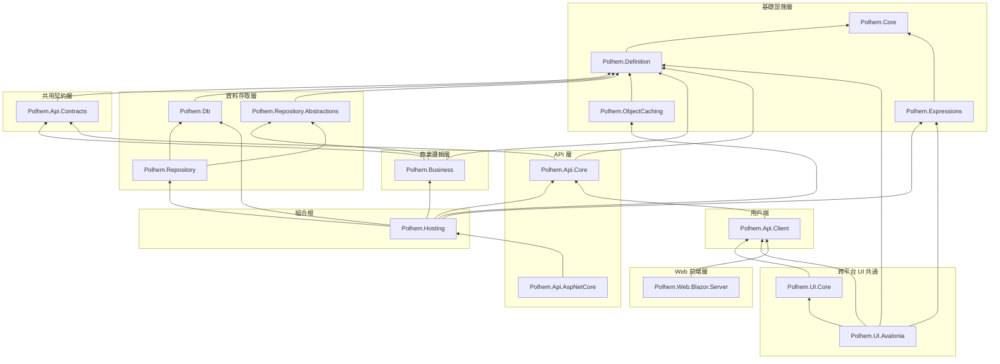

<!-- source: en/architecture/dependency-map.md blob: 2a5bb5de65bf1ba6fa7a2751c0a13e54b7393ddd -->
# 專案相依性全景圖

[English](../../en/architecture/dependency-map.md) · [← 文件索引](../README.md)

本文件以視覺化方式呈現 Polhem 框架中 `src/` 專案之間的相依關係。
圖中涵蓋的是執行期套件；`Polhem.Analyzers` 不列入，因為執行期沒有任何專案參考它 ——
消費端拿到的是建置期 analyzer，畫進去等於多一條組件圖上不存在的邊。
（此處不寫專案數：那會漂，而 `src/` 目錄本身就是權威來源。）

**閱讀方式**：箭頭方向 A → B 表示「A 依賴 B」；圖表由下而上排列，最底層為無相依性的基礎套件。

## 相依性圖表

## 外部相依套件

| 專案 | 外部套件 |
|------|----------|
| Polhem.Core | *(none)* |
| Polhem.Expressions | DynamicExpresso.Core 2.x |
| Polhem.Definition | Microsoft.Extensions.Localization.Abstractions 10.x |
| Polhem.Db | *(none)* |
| Polhem.ObjectCaching | Microsoft.Extensions.Caching.Memory 10.x、Microsoft.Extensions.Logging.Abstractions 10.x |
| Polhem.Api.Core | MessagePack 3.x、Microsoft.Extensions.Logging.Abstractions 10.x |
| Polhem.Business | Microsoft.Extensions.DependencyInjection.Abstractions 10.x、Microsoft.Extensions.Logging.Abstractions 10.x |
| Polhem.Repository | Microsoft.Extensions.DependencyInjection.Abstractions 10.x |
| Polhem.Hosting | Microsoft.Extensions.DependencyInjection.Abstractions 10.x、Microsoft.Extensions.Hosting.Abstractions 10.x |
| Polhem.Api.AspNetCore | `FrameworkReference: Microsoft.AspNetCore.App` |
| Polhem.Web.Blazor.Server | `FrameworkReference: Microsoft.AspNetCore.App` |
| Polhem.UI.Avalonia | Avalonia 12.0.x、Avalonia.Controls.DataGrid 12.0.x |
| Polhem.Api.Contracts / Polhem.Api.Client / Polhem.Repository.Abstractions / Polhem.UI.Core | *(none)* |

> `Polhem.Api.Core` 的 MessagePack 是框架內**唯一**的傳輸格式套件，而讓它維持唯一正是
> [ADR-036](../../../maintainers/adr/adr-036-wire-serialization-externalized.md) 的用意。僅建置期的參考
> （`PrivateAssets="all"`：SourceLink、公開 API 分析器、本 repo 自己的 analyzer）
> 不列入 —— 它們不會流到任何消費者。

## 目標框架摘要

所有執行期套件皆以 `net10.0` 單一目標發布。例外是 `Polhem.Analyzers`，它以 `netstandard2.0` 為目標
—— Roslyn 就是以該框架載入 analyzer，這是 analyzer host 的要求而非選擇。

## 工具套件（獨立發行）

不屬於上方 `src/` 套件相依圖——以 `dotnet tool` 全域工具形式 ship 在 NuGet：

| 套件 | 命令 | 說明 |
|------|------|------|
| **Polhem.Cli**（`tools/Polhem.Cli/`） | `dotnet polhem` | 框架 CLI；`dotnet polhem --help` 列出其命令。引用 `Polhem.Definition`，呼叫其公開 `Defaults` API 處理 embedded 框架預設的 materialize / list。版本與框架一致（兩者都讀 `Version.props`）。 |

同位於 `tools/` 但不上 NuGet：

- **Polhem.DefineEditor**（`tools/DefineEditor/`）—— Avalonia 桌面工具，可視覺化編輯各種定義類型。以 `.app` / `.exe` 形式對外發行而非套件或 dotnet tool。開啟資料夾時 in-process 呼叫 `Polhem.Definition.Defaults.MaterializeTo(...)`。

## 架構要點

- **Polhem.Core** 為最底層基礎套件，無任何內部相依性。
- **Polhem.Expressions** 只承載 `DynamicExpressoEvaluator`——運算式引擎以 DynamicExpresso 為底的實作。**抽象**（`IExpressionEvaluator`、`ExpressionPolicy`、`ExpressionEvaluationException`）位於 `Polhem.Core.Expressions`，因此 `Polhem.Definition`（`FormExpressionCalculator`）與 `Polhem.Business`（規則處理器）消費引擎時不會相依 DynamicExpresso；只有決定用哪個實作的組裝層（`Polhem.Hosting` 的 DI 註冊、`Polhem.UI.Avalonia` 的前端即時預覽）才引用本套件。這個分界讓定義層不帶第三方套件，同時維持前端算值與後端存檔一致。見 [adr-028](../../../maintainers/adr/adr-028-expression-rule-engine.md) 與 [adr-038](../../../maintainers/adr/adr-038-definition-dependency-boundary.md)。
- **Polhem.Definition** 為被依賴次數最多的專案，直接相依者為 Contracts、Db、RepoAbs、Caching、Business、Api.Core 與 UI.Avalonia。
- **Polhem.Api.Contracts** 是共用契約／抽象層，並非應用層級的 API 專案。雖名為「API」，但 `Polhem.Business` 與 `Polhem.Api.Core` 都相依於它（`Business → Contracts`、`Core → Contracts`），故其位置在兩者**之下** —— 圖上歸入 **共用契約層**，而非 API 應用層。
- **Polhem.Hosting** 為 composition root：將後端服務（`Polhem.Api.Core`、`Polhem.Business`、`Polhem.Db`、`Polhem.Repository`、`Polhem.ObjectCaching`）整合於一個 `IServiceCollection.AddPolhemFramework` 擴充入口，不依賴 ASP.NET Core。非 web 宿主（WinForms、Console、Worker Service）直接引用此套件。圖上獨立列為 **組合根** 而非歸入 API 層：橫跨各層本就是組合根的職責，故「API 層不得直接引用 Repository 層」的限制不適用於它。真正適用的是**它本身不含資料存取** —— SQL 語句歸 `Polhem.Db` / `Polhem.Repository`，Hosting 只留 hosted service 外殼與 DI 接線。
- **Polhem.Api.AspNetCore** 為 ASP.NET Core 整合層：`ApiServiceController`（JSON-RPC 端點的基底 controller），以及 `UsePolhemFramework`（執行宿主端的啟動檢查，不註冊任何 middleware）。它透過遞移引用 `Polhem.Hosting`，使 web 宿主一次引用即取得 DI 註冊與端點。
- 用戶端（Polhem.Api.Client）與伺服器端（Polhem.Api.AspNetCore）皆透過 **Polhem.Api.Core** 共享協定邏輯，確保序列化與加解密行為一致。
- **Polhem.UI.Core** 為跨平台 UI 共通層（`ClientInfo` / `IEndpointStorage` / `FileEndpointStorage` / `IUIViewService`），供所有 native UI family（目前為 Avalonia，以單一專案涵蓋桌面 / 瀏覽器（WASM）/ iOS / Android；未來 WinForms / WPF）共用 client-side 連線狀態與 endpoint 持久化邏輯；不含任何平台專屬 UI 程式碼，只依 `Polhem.Api.Client`。
- **Polhem.UI.Avalonia** 為 Avalonia 控制項套件，供桌面、瀏覽器（WASM）、iOS 與 Android 各端使用；各端需要什麼見[平台支援](../getting-started/platform-support.md)。內含 FormSchema 驅動控制項（`FormView` 單筆、`ListView` 清單、`GridControl` 表格，加上一組 field editor 與 `FormScope` ambient 綁定，皆以 `FormDataObject` 為資料中樞），單一 `net10.0` TFM。它對 `Avalonia` 與 `Avalonia.Controls.DataGrid` 的參考是版本下限；host 可以帶入更新的 `Avalonia 12.0.x`。DataGrid 為何不走 `Binding "[FieldName]"` 詳見 [adr-020](../../../maintainers/adr/adr-020-avalonia-datagrid-binding-strategy.md)，編輯策略詳見 [adr-021](../../../maintainers/adr/adr-021-avalonia-datagrid-editing-strategy.md)。
- **`Polhem.UI.*` family 判別準則**：是否消費 `Polhem.UI.Core` 抽象（`ClientInfo` / `IEndpointStorage` / `IUIViewService` 等）。
  - 消費 → 歸 `Polhem.UI.*`（目前：`Polhem.UI.Core`、`Polhem.UI.Avalonia`；未來：`Polhem.UI.WinForms`、`Polhem.UI.Wpf` 等同理）
  - 不消費，自有狀態管理 → 走獨立 family prefix（如 `Polhem.Web.Blazor.*`：Blazor circuit 無檔案 IO 與 dialog service 概念，獨立路線合理）
- **Web 前端層**（`Polhem.Web.Blazor.Server`）為 RCL（Razor Class Library）元件庫，只相依 `Polhem.Api.Client`，由宿主在 `AddPolhemBlazor` 選擇 `IJsonRpcProvider` 實作：`UseRemoteProvider`（經 HTTP 的 `RemoteApiProvider`），或 `UseLocalProvider`（in-process 的 `LocalApiProvider`，僅限受信任的使用者，且須在同一個 service collection 上呼叫 `AddPolhemFramework`）。
