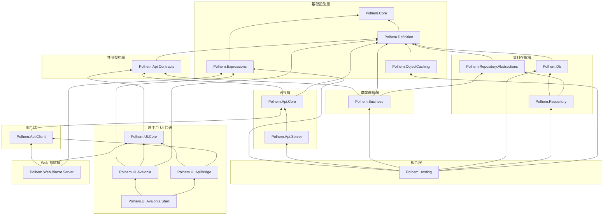

<!-- source: en/architecture/dependency-map.md blob: 79d3a3f32e0820e2d775e7faddd4ee030f51680b -->
# 專案相依性全景圖

[English](../../en/architecture/dependency-map.md) · [← 文件索引](../README.md)

本文件以視覺化方式呈現 Polhem 框架中 `src/` 專案之間的相依關係。
圖中涵蓋的是執行期套件；`Polhem.Analyzers` 不列入，因為執行期沒有任何專案參考它 ——
消費端拿到的是建置期 analyzer，畫進去等於多一條組件圖上不存在的邊。
（此處不寫專案數：那會漂，而 `src/` 目錄本身就是權威來源。）

**閱讀方式**：箭頭方向 A → B 表示「A 依賴 B」；圖表由下而上排列，最底層為無相依性的基礎套件。

## 相依性圖表

```mermaid
graph BT
  subgraph 基礎設施層
    Base["Polhem.Core"]
    Expressions["Polhem.Expressions"]
    Definition["Polhem.Definition"]
    Caching["Polhem.ObjectCaching"]
  end

  subgraph 資料存取層
    RepoAbs["Polhem.Repository.Abstractions"]
    Db["Polhem.Db"]
    Repo["Polhem.Repository"]
  end

  subgraph 商業邏輯層
    Business["Polhem.Business"]
  end

  subgraph SharedContracts [共用契約層]
    Contracts["Polhem.Api.Contracts"]
  end

  subgraph API 層
    Core["Polhem.Api.Core"]
    Server["Polhem.Api.Server"]
  end

  subgraph CompositionRoot [組合根]
    Hosting["Polhem.Hosting"]
  end

  subgraph 用戶端
    Client["Polhem.Api.Client"]
  end

  subgraph 跨平台 UI 共通
    UICore["Polhem.UI.Core"]
    UIAvalonia["Polhem.UI.Avalonia"]
    UIApiBridge["Polhem.UI.ApiBridge"]
    UIShell["Polhem.UI.Avalonia.Shell"]
  end

  subgraph Web 前端層
    BlazorSrv["Polhem.Web.Blazor.Server"]
  end

  Definition --> Base
  Expressions --> Base
  Hosting --> Expressions
  UIAvalonia --> Expressions
  Contracts --> Definition
  Db --> Definition
  RepoAbs --> Definition
  Caching --> Definition
  Business --> Contracts
  Business --> Definition
  Business --> RepoAbs
  Repo --> Db
  Repo --> RepoAbs
  Core --> Contracts
  Core --> Definition
  Server --> Core
  Hosting --> Server
  Hosting --> Business
  Hosting --> Db
  Hosting --> Repo
  Hosting --> Caching
  Client --> Core
  UICore --> Contracts
  UIAvalonia --> UICore
  UIAvalonia --> Definition
  UIApiBridge --> UICore
  UIApiBridge --> Client
  UIShell --> UIAvalonia
  UIShell --> UIApiBridge
  BlazorSrv --> Client
  BlazorSrv --> UICore
  BlazorSrv --> Expressions
```

## 外部相依套件

| 專案 | 外部套件 |
|------|----------|
| Polhem.Core | *(none)* |
| Polhem.Expressions | DynamicExpresso.Core 2.x |
| Polhem.Definition | Microsoft.Extensions.Localization.Abstractions 10.x |
| Polhem.Db | *(none)* |
| Polhem.ObjectCaching | Microsoft.Extensions.Caching.Memory 10.x、Microsoft.Extensions.Logging.Abstractions 10.x |
| Polhem.Api.Core | MessagePack 3.x、Polhem.JsonRpc.Payload |
| Polhem.Api.Server | Microsoft.Extensions.Logging.Abstractions 10.x、Polhem.JsonRpc.Server、Polhem.JsonRpc.Payload.Server |
| Polhem.Business | Microsoft.Extensions.DependencyInjection.Abstractions 10.x、Microsoft.Extensions.Logging.Abstractions 10.x |
| Polhem.Repository | Microsoft.Extensions.DependencyInjection.Abstractions 10.x |
| Polhem.Hosting | Microsoft.Extensions.DependencyInjection.Abstractions 10.x、Microsoft.Extensions.Hosting.Abstractions 10.x |
| Polhem.Web.Blazor.Server | `FrameworkReference: Microsoft.AspNetCore.App` |
| Polhem.UI.Avalonia | Avalonia 12.x、Avalonia.Controls.DataGrid 12.x |
| Polhem.Api.Client | Polhem.JsonRpc.Payload.Client |
| Polhem.UI.ApiBridge | Microsoft.Extensions.DependencyInjection.Abstractions 10.x |
| Polhem.UI.Avalonia.Shell | Avalonia 12.x, Avalonia.Controls.DataGrid 12.x, Semi.Avalonia 12.x, Semi.Avalonia.DataGrid 12.x, CommunityToolkit.Mvvm 8.x, Microsoft.Extensions.DependencyInjection 10.x |
| Polhem.Api.Contracts / Polhem.Repository.Abstractions / Polhem.UI.Core | *(none)* |

> `Polhem.Api.Core` 的 MessagePack 是框架內**唯一**的傳輸格式套件，而讓它維持唯一正是
> [ADR-036](../../../maintainers/adr/adr-036-wire-serialization-externalized.md) 的用意。`Polhem.JsonRpc.*` 套件維護在
> [polhem-dev/polhem-jsonrpc](https://github.com/polhem-dev/polhem-jsonrpc)，框架使用的版本設定在 repo 根目錄的
> `PolhemJsonRpc.props`；HTTP 宿主自行加入 `Polhem.JsonRpc.AspNetCore`。僅建置期的參考
> （`PrivateAssets="all"`：SourceLink、公開 API 分析器、本 repo 自己的 analyzer）
> 不列入 —— 它們不會流到任何消費者。

## 目標框架摘要

所有執行期套件皆以 `net10.0` 單一目標發布。例外是 `Polhem.Analyzers`，它以 `netstandard2.0` 為目標
—— Roslyn 就是以該框架載入 analyzer，這是 analyzer host 的要求而非選擇。

## 工具套件（獨立發行）

不屬於上方 `src/` 套件相依圖——以 `dotnet tool` 全域工具形式 ship 在 NuGet：

| 套件 | 命令 | 說明 |
|------|------|------|
| **Polhem.Cli**（`tools/Polhem.Cli/`） | `dotnet polhem` | 框架 CLI；`dotnet polhem --help` 列出其命令。引用 `Polhem.Definition`，呼叫其公開 `Defaults` API 處理 embedded 框架預設的 materialize / list。版本與框架一致（兩者都讀 `Version.props`）。 |
| **Polhem.DefineEditor**（`tools/DefineEditor/`） | `polhem-define` | Avalonia 桌面工具，可視覺化編輯各種定義類型；也可建置成 macOS `.app`。不帶資料庫驅動：資料庫相關工作交給 Polhem.DbManager。 |
| **Polhem.DbManager**（`tools/DbManager/`） | `polhem-db` | 以所有支援資料庫的驅動，對定義資料夾執行 `Polhem.Hosting` 的 `db` 指令。 |

## 架構要點

- **Polhem.Core** 為最底層基礎套件，無任何內部相依性。
- **Polhem.Expressions** 只承載 `DynamicExpressoEvaluator`——運算式引擎以 DynamicExpresso 為底的實作。**抽象**（`IExpressionEvaluator`、`ExpressionPolicy`、`ExpressionEvaluationException`）位於 `Polhem.Core.Expressions`，因此 `Polhem.Definition`（`FormExpressionCalculator`）與 `Polhem.Business`（規則處理器）消費引擎時不會相依 DynamicExpresso；只有決定用哪個實作的組裝層（`Polhem.Hosting` 的 DI 註冊、`Polhem.UI.Avalonia` 與 `Polhem.Web.Blazor.Server` 的前端即時預覽）才引用本套件；兩端共用的即時預覽引擎 `Polhem.UI.Core` 的 `FormLiveComputationEngine` 由它們傳入運算引擎。這個分界讓定義層不帶第三方套件，同時維持前端算值與後端存檔一致。見 [adr-028](../../../maintainers/adr/adr-028-expression-rule-engine.md) 與 [adr-038](../../../maintainers/adr/adr-038-definition-dependency-boundary.md)。
- **Polhem.Definition** 為被依賴次數最多的專案，直接相依者為 Contracts、Db、RepoAbs、Caching、Business、Api.Core 與 UI.Avalonia。
- **Polhem.Api.Contracts** 是共用契約／抽象層，並非應用層級的 API 專案。雖名為「API」，但 `Polhem.Business` 與 `Polhem.Api.Core` 都相依於它（`Business → Contracts`、`Core → Contracts`），故其位置在兩者**之下** —— 圖上歸入 **共用契約層**，而非 API 應用層。
- **Polhem.Hosting** 為 composition root：將後端服務（`Polhem.Api.Server`、`Polhem.Business`、`Polhem.Db`、`Polhem.Repository`、`Polhem.ObjectCaching`）整合於一個 `IServiceCollection.AddPolhemFramework` 擴充入口，不依賴 ASP.NET Core。非 web 宿主（WinForms、Console、Worker Service）直接引用此套件。圖上獨立列為 **組合根** 而非歸入 API 層：橫跨各層本就是組合根的職責，故「API 層不得直接引用 Repository 層」的限制不適用於它。真正適用的是**它本身不含資料存取** —— SQL 語句歸 `Polhem.Db` / `Polhem.Repository`，Hosting 只留 hosted service 外殼與 DI 接線。
- **JSON-RPC 協定**來自 `Polhem.JsonRpc.*` 套件，它們對 Polhem 一無所知：`Polhem.Api.Server` 建在 `Polhem.JsonRpc.Server` 上，`Polhem.Api.Client` 建在 `Polhem.JsonRpc.Client` 上（經由 `Polhem.JsonRpc.Payload.Client`，以其 `PayloadConnector` 封裝每次呼叫），ASP.NET Core 宿主另加 `Polhem.JsonRpc.AspNetCore` 提供 `POST /api` 端點。相依只走這個方向。見 [ADR-049](../../../maintainers/adr/adr-049-jsonrpc-packages-in-1-2.md)（英文）。
- **Polhem.Api.Core** 是前後端共用的 wire 層：請求與回應訊息、payload codec、壓縮與加密，以及錯誤契約，讓用戶端（`Polhem.Api.Client`）與伺服器端的序列化與加解密行為一致。它不含任何伺服器端的東西，並由 `POLHEM9001` 把關。**Polhem.Api.Server** 放伺服器端：dispatcher 的設定、存取與 payload 篩選器、API 金鑰與授權檢查，以及例外對應。同程序的用戶端透過 `AddPolhemFramework` 註冊的 `IInProcessTransportFactory` 呼叫 dispatcher，因此 `Polhem.Api.Client` 不帶任何伺服器端套件。`Polhem.Api.Server` 會讀取 `Polhem.Api.Core` 的 internal 成員，所以兩者必須是完全相同的版本。詳見 [adr-055](../../../maintainers/adr/adr-055-api-core-split-from-server.md)。
- **前端與後端共用三個基礎組件**：`Polhem.Core`、`Polhem.Definition` 與 `Polhem.Api.Contracts`。它們不放只屬於單一端的東西；前端只透過 `Polhem.Api.Contracts` 的契約接觸後端（表單是 `IFormApiConnector` 與 `IFormApiConnectorFactory`），傳輸層（`Polhem.Api.Core`、`Polhem.Api.Client`）不在前端的相依閉包內。見 [adr-054](../../../maintainers/adr/adr-054-front-end-decoupled-from-api-client.md)（英文）。
- **Polhem.UI.Core** 為所有前端共用的一層，不帶任何傳輸：只引用 `Polhem.Api.Contracts`。內含 UI 的服務契約（`IFormDefinitionSource`、`IUserContext`）與 `UIServices`（由 markup 建立的控制項透過它解析這些服務）；各端共用的表單值規則（`FormValueBinding`、`FormDataGuard`，以及位於 `Polhem.UI.Core.Permissions` 的元素能力解析器）；`StorageDefinitionSource`，建在 `IDefineStorage` 上、供沒有後端的應用程式使用的定義來源；以及供自行實作 `IFormApiConnector` 的應用程式使用的簡單回應型別。不含任何平台專屬 UI 程式碼。
- **Polhem.UI.ApiBridge** 將單一使用者的端（桌面、瀏覽器（WASM）、iOS、Android）接上 Polhem 後端。它引用 `Polhem.UI.Core` 與 `Polhem.Api.Client`，本身與 UI 框架無關。內含 `ClientInfo`（該端的連線狀態）與 endpoint、API key 的儲存（`IEndpointStorage`、`IApiKeyStorage`、`FileEndpointStorage`），並以 `AddPolhemUIApiBridge()` 註冊 `Polhem.UI.Core` 服務的 API 版實作。相依由 bridge 指向兩側：`Polhem.Api.Client` 從不引用 UI。
- **Polhem.UI.Avalonia** 為 Avalonia 控制項套件，供桌面、瀏覽器（WASM）、iOS 與 Android 各端使用；各端需要什麼見[平台支援](../getting-started/platform-support.md)。內含 FormSchema 驅動控制項（`FormView` 單筆、`ListView` 清單、`GridControl` 表格，加上一組 field editor 與 `FormScope` ambient 綁定，皆以 `FormDataObject` 為資料中樞），單一 `net10.0` TFM。它引用 `Polhem.UI.Core`、`Polhem.Definition` 與 `Polhem.Expressions`，不引用 `Polhem.Api.Client`：控制項接收 `IFormApiConnector`，所以應用程式提供自己的 connector 時，不需要 Polhem 後端也能運作。它對 `Avalonia` 與 `Avalonia.Controls.DataGrid` 的參考是版本下限；host 可以帶入更新的 `Avalonia 12.x`。DataGrid 為何不走 `Binding "[FieldName]"` 詳見 [adr-020](../../../maintainers/adr/adr-020-avalonia-datagrid-binding-strategy.md)，編輯策略詳見 [adr-021](../../../maintainers/adr/adr-021-avalonia-datagrid-editing-strategy.md)。
- **Polhem.UI.Avalonia.Shell** 是建立在上面兩個套件之上的現成前端：連線、登入公司，並以分頁開啟伺服器選單上的表單。它位在端（head）的層級，與應用程式自己的 UI 專案並列，因為它需要 `Polhem.UI.ApiBridge`，而 `Polhem.UI.Avalonia` 不得引用它。它也負責套用 Semi 主題，所以只有採用殼的應用程式才會相依這個主題。應用程式繼承 `ShellApplication`；細節見該套件的 README。
- **`Polhem.UI.*` family 判別準則**：所有前端都引用 `Polhem.UI.Core`，所以是否引用它已不能決定 family。決定的是套件是否建立在單一使用者模型上：一個 process 服務一位已登入使用者，服務來自整個 process 共用的 `UIServices.Provider`（有後端時再加上 `Polhem.UI.ApiBridge`）。
  - 單一使用者 → 歸 `Polhem.UI.*`（目前：`Polhem.UI.Core`、`Polhem.UI.ApiBridge`、`Polhem.UI.Avalonia`、`Polhem.UI.Avalonia.Shell`；未來：`Polhem.UI.WinForms`、`Polhem.UI.Wpf` 等同理）
  - 一個 process 服務多位使用者、自有狀態管理 → 走獨立 family prefix（如 `Polhem.Web.Blazor.*`）。Blazor 端過去不引用 `Polhem.UI.Core`，是因為該套件持有整個 process 共用的 `ClientInfo`；這份狀態已移到 `Polhem.UI.ApiBridge`，所以 Blazor 端現在為了共用的值規則引用 `Polhem.UI.Core`，但不得使用 `UIServices`，也不得引用 `Polhem.UI.ApiBridge`。違反時 `UIServicesUsageGateTests`（`tests/Polhem.Web.Blazor.Server.UnitTests`）會失敗。
- **Web 前端層**（`Polhem.Web.Blazor.Server`）為 RCL（Razor Class Library）元件庫，相依 `Polhem.Api.Client`，為了與 native 各端共用的值規則相依 `Polhem.UI.Core`，並為了計算欄位的即時預覽相依 `Polhem.Expressions`，由宿主在 `AddPolhemBlazor` 選擇傳輸方式：`UseRemoteProvider`（每個 circuit 的 `PolhemApiClient` 經 HTTP 呼叫），或 `UseLocalProvider`（in-process 呼叫，僅限受信任的使用者，且須在同一個 service collection 上呼叫 `AddPolhemFramework`）。
